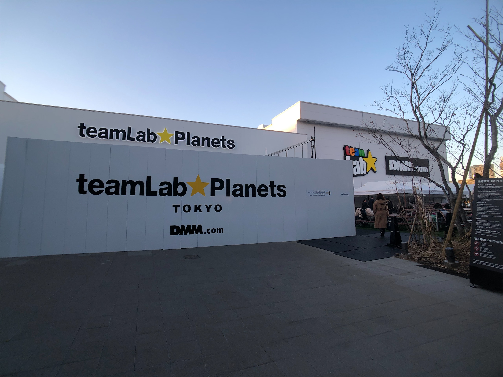
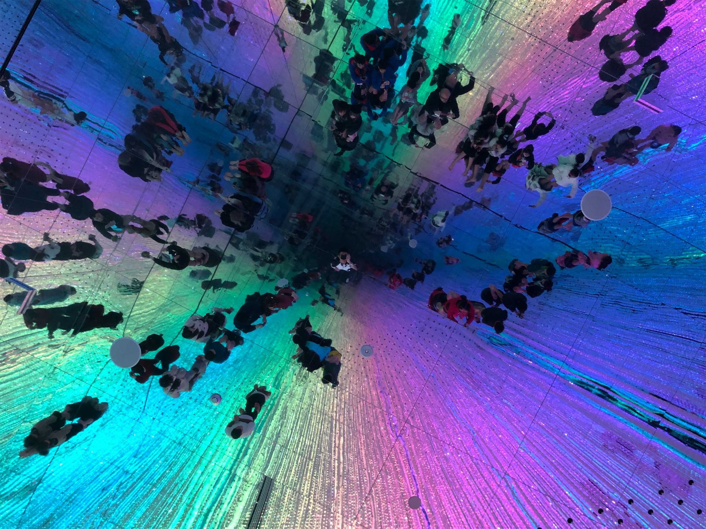
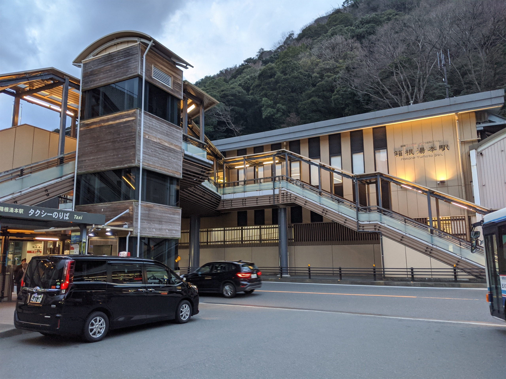
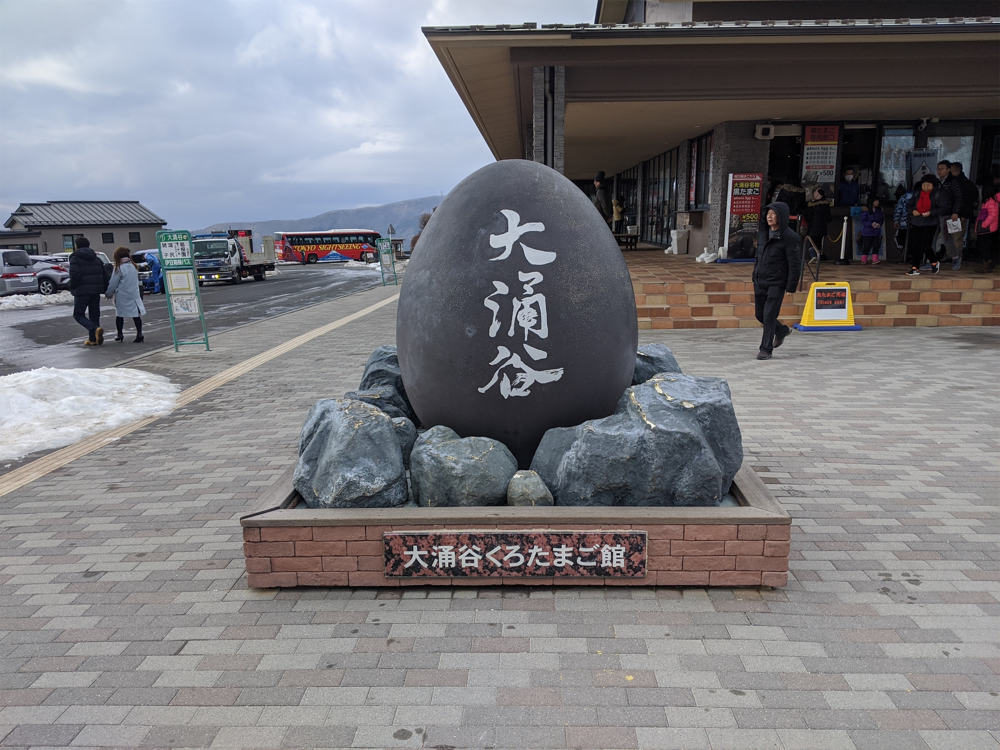
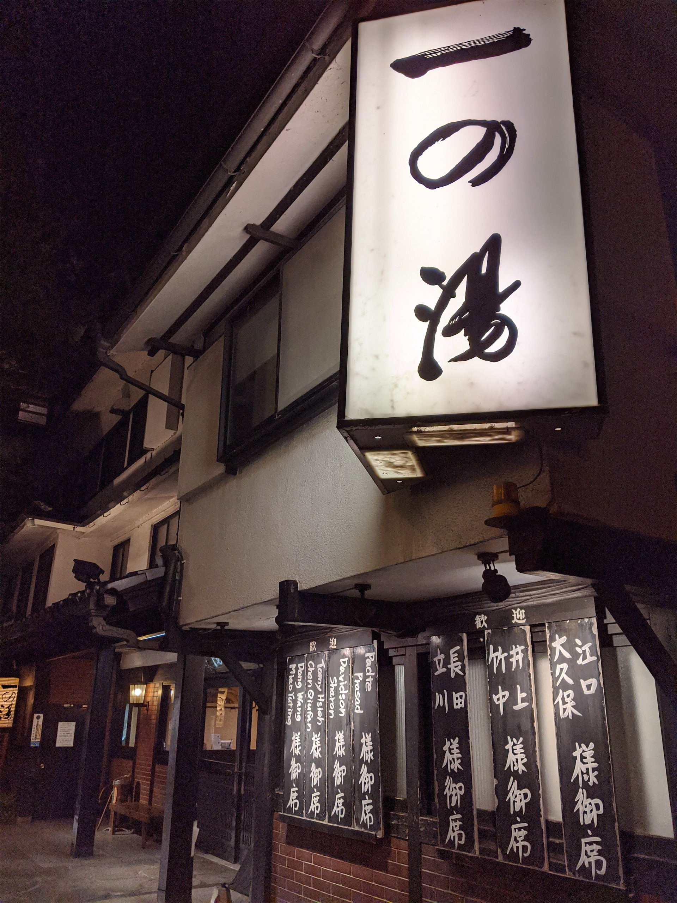
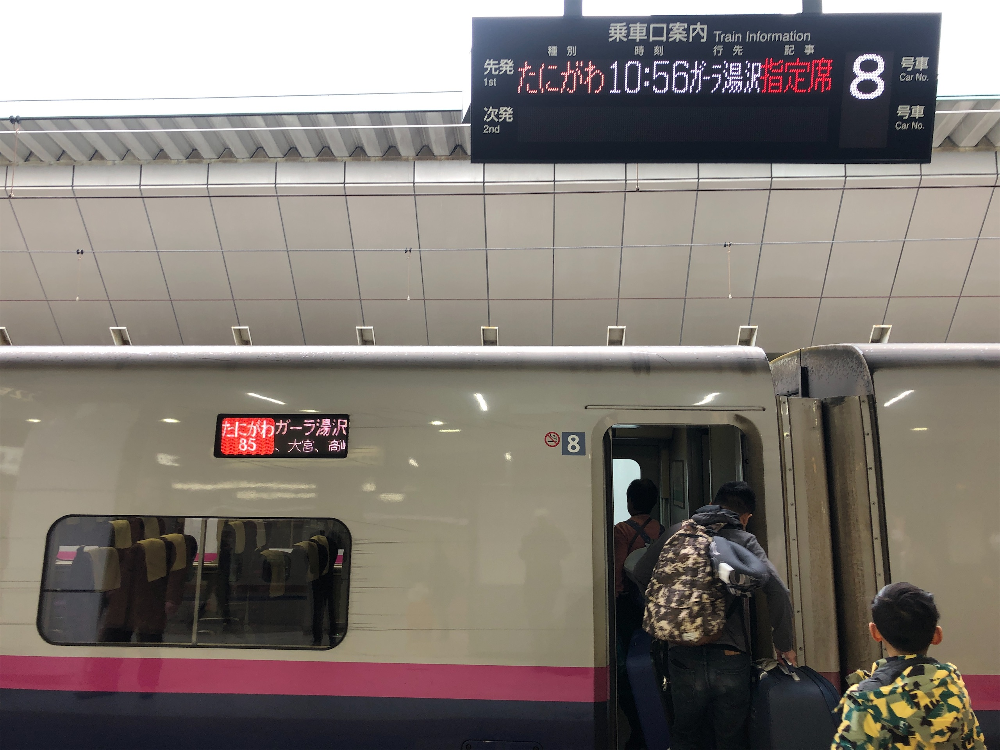
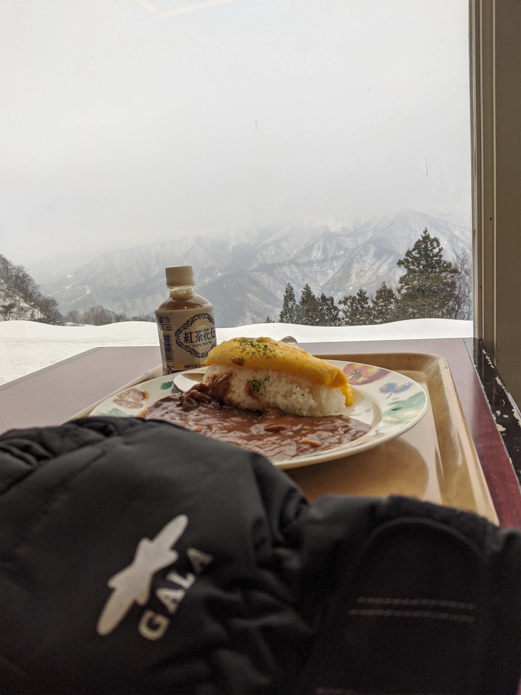
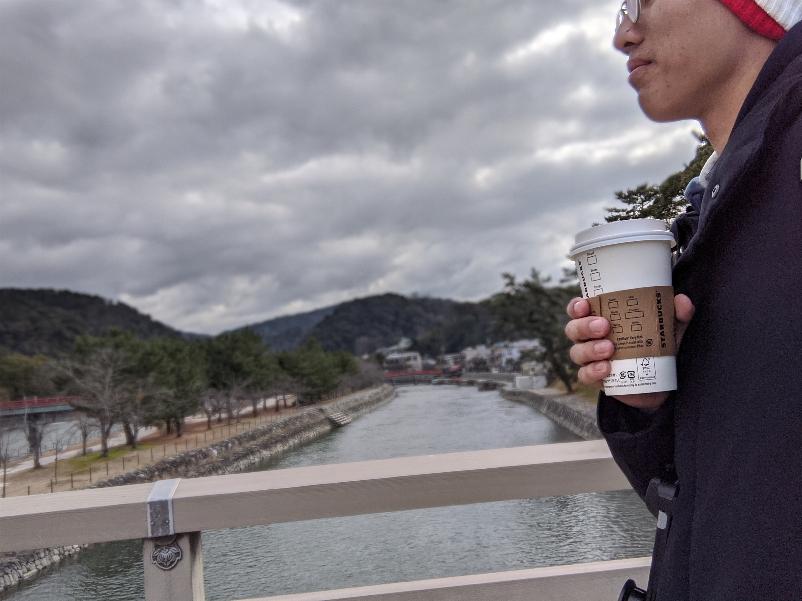

## Day 5

東京市區的最後一個行程來自我幾年前在華山看的一個展覽，teamLab 的互動藝術展。這個展應該是我少數看完之後印象特別深刻的展，所以回家之後就一直有繼續追蹤這個工作室。

那時候看到網站上的資料我就有發現其實海外展出的 (包含來台灣我看的那一次) 都只能算是低配版，所以我這次來東京台場主場館就是想來看相對比較完整的版本。所以究竟低配版跟完整版差在哪，我覺得主要有兩個，一個是場館面積，完整版我估應該比台北華山的倉庫大個 3 倍左右，面積大小除了會影響展覽的子區域 (展覽項目) 有多少，也會影響到單一個區域能有多大的互動空間；另一個最大的不同就是，參觀完整版的展覽前要脫鞋子，因為有一部分展區是有水的，但即便是在沒有水的展區，我覺得赤腳走在不同材質地板的展區其實也更完整了不同的感官體驗。總而言之就是一個非常 mind-blowing 的展覽，我覺得可能很難有其他工作室短期內能複製相似的體驗。

非常剛好，teamLabs 下個月又要巡迴來台灣了，這次是在士林科教館。雖然我估計應該也是低配版，但還是很推薦大家去看，沒意外我應該也會找時間再去看一次。(想不到我也會有業配吧 ((並沒有

")

## Day 6

離開東京之後的下一站，是這趟旅程少數比較親近大自然的行程——箱根。如果要一句話描述箱根，那大概就是「溫泉版日月潭」，概念很簡單，就是有一座湖，周邊有一些不算雷、可以踩點、但好像沒去也不會可惜的小景點。

但是來這個地方最適合做的事情其實是「什麼都不做」，如果你想要再爽一點點，就直接找一間有天然溫泉的旅館，保證 chill 出新高度。但我前面也說我的這一段行程是大自然，所以前面這一大串領悟都是我在走完一大圈之後才發現的小撇步，要是有人早點跟我說後面的景點其實很普，我大概下午 3 點直接旅館躺平。

## Day 7

這趟旅程最後一天的計畫本來是在早上接近中午的時候抵達名古屋，然後會在市區踩幾個點，最後去名花之里看個夕陽。身為一個從小到大沒看過天空下雪的人，我在出發前沒來由的產生了一個錯誤的認知，就是 1 月多的箱根每天都在下雪。雖然我在出發前本來沒有特別在意有沒有看到下雪這件事，但不知道身上哪根毛突然被雷劈到，就覺得我這一趟非看到天空下一場雪不可，所以在吃完晚餐、泡完溫泉回房間之後，我馬上就打開電腦開始找能看得到下雪的地方。

所以就只為了看這一場雪，我捨棄了原本名古屋的行程，搭往名古屋相反的方向，來到 GALA 湯澤滑雪度假村，吃了一頓午餐和一支冰淇淋，堆了一個雪人，然後再往回頭搭 4~5 個小時的新幹線趕最後一班特急列車到到名古屋機場的旅館 check-in 。

礙於這系列的遊記有點歹戲拖棚，最後隔天我錯過回台灣的飛機，然後差點要在名古屋吃年夜飯的故事我就先不說了，該是來總結一下這趟旅行了。

說是紀念或是慶祝都行，我想我的確是透過促使這段旅行成行所代表的一種儀式感，來向我生命中的某個階段告別，並且準備好 move on 到下一個階段了，但除了儀式感的表面，實際旅程的種種細節也算是為這個儀式感烙下了一些更深刻的感受。

小的時候，很多題目的選項都是周遭的大人挑過的選項，而這些選項，會在慢慢長大之後變的模糊，甚至消失。這雖然不是一件容易被察覺的事情，但我覺得是一個衡量長大成人非常重要的指標，也是我在這趟旅程最大的感觸——長大的意義就是要自己做主了。而自己作主的意思就是自己要能夠去承擔選擇背後的後果。雖然聽起來很困難，但好處也相對明顯：當檯面上的選項都差強人意，那就勇敢的去創造一個新的。

而我想也就是透過主導這些選擇，最終使一個人的人格變的更加立體，更證明自己真真實實的活著吧。
