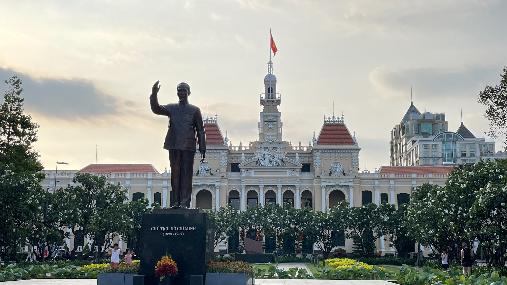
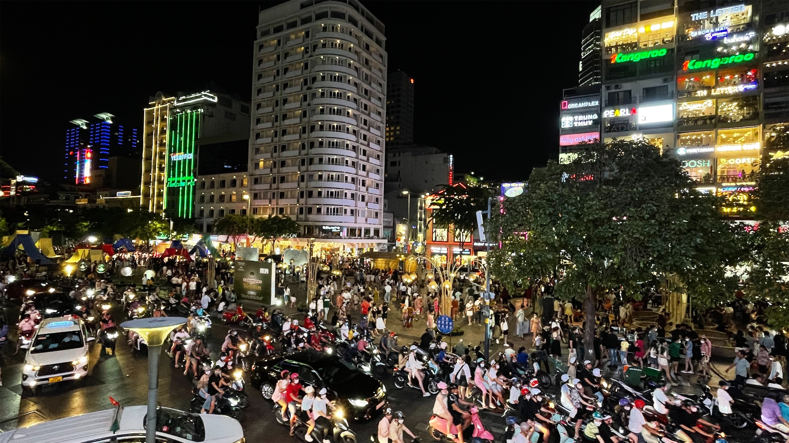
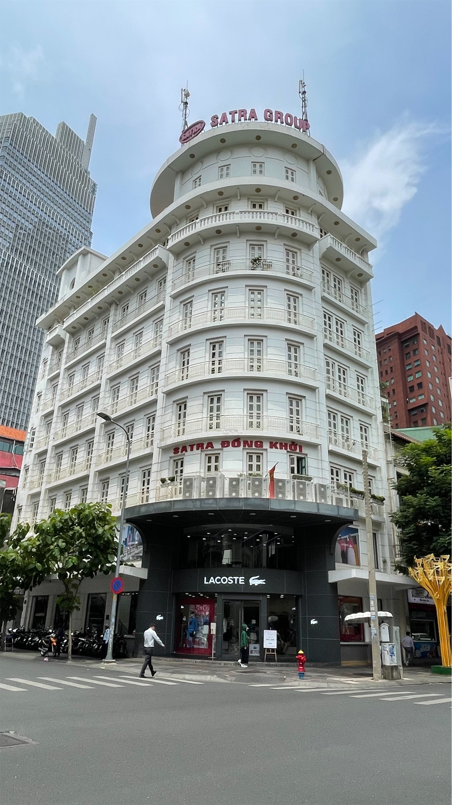
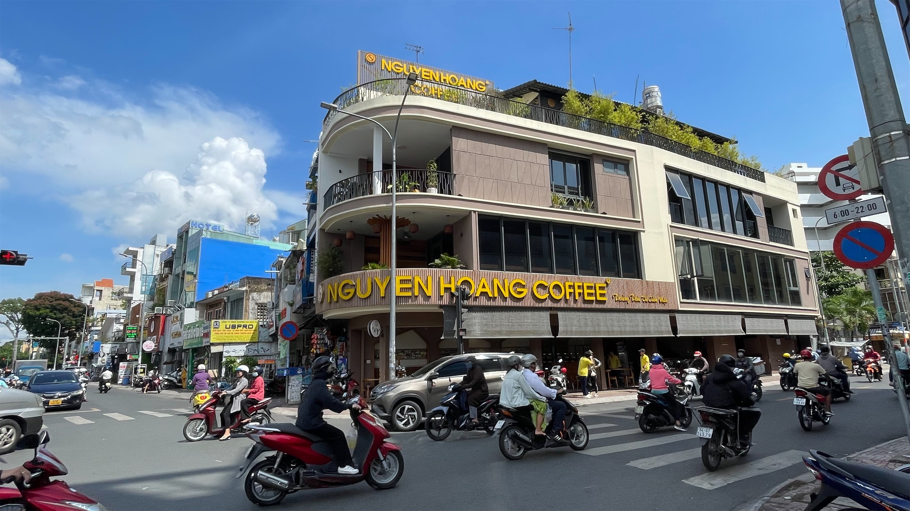
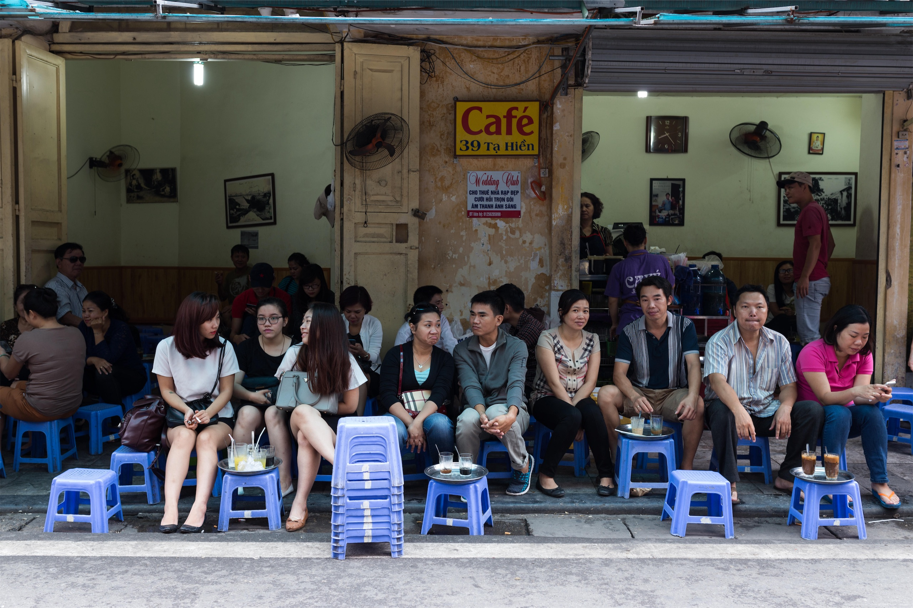
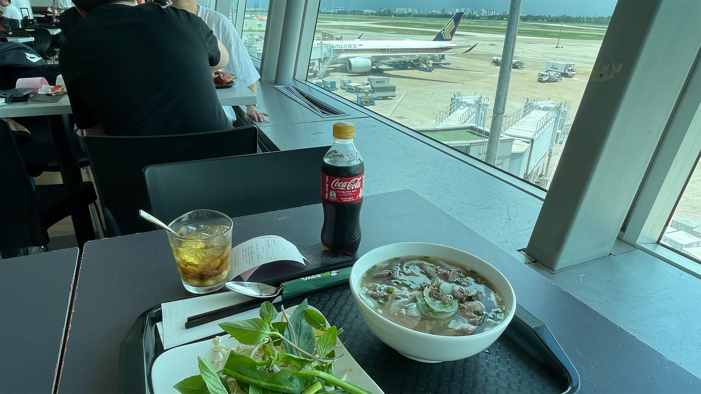
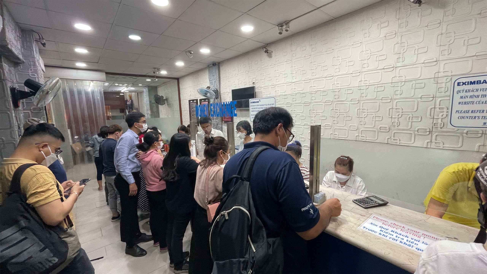

<small>抄襲要註明，這個廢到笑的副標題是抄襲自[采翎的 vlog](https://www.youtube.com/watch?v=x2ghih542GI)，難笑不要怪我 😂😂</small>

總共~~七七四十九天~~ 39 天的春假結束啦！！！

依照上一篇曼谷的慣例，當然要來寫一下我的西貢心得的吧 😏

這一趟出來原本只有計畫要去曼谷一個月，當時在看機票的時候，最便宜的選項是越捷航空，但其實越捷航空主要的市場是越南，台北曼谷這一段只是兼營的，後來看著看著就覺得，欸好像多去一個越南也不會多花太多錢，花費差不多，只多了中間這段機票的錢，大約 $2000 上下而已，薯條都可以加大了，沒道理出國玩不能小捏一下吧 (什麼邏輯？？

於是這段旅程就從 30 天曼谷升級成 21 天曼谷 + 19 天西貢了哈哈哈哈

## 🤷🏻 所以是胡志明市還是西貢

在以前南北越分治的時候，統一的大業一直是越南共產黨創黨主席胡志明的夢想，只是他在 1969 年的時候就病逝了，好巧不巧那天還剛好是北越國慶日。於是在 1975 年越戰結束、南北越統一的時候，越南政府就把南越的最大城市——西貢，改名為胡志明市來紀念他。

在前面的幾篇文章我都還是以胡志明市來指稱，可是因為西貢這個地名已經使用了非常久，再者，不論是越語還是英語，西貢 (Saigon) 講起來還是比較順口，因此這個名字仍然廣泛的被當地人及西方觀光客使用。其實我自己也覺得用西貢來稱呼這做城市感覺更有一種風韻，甚至是親密的感覺。

如果對這兩個名字的故事有興趣，可以看看[這篇文章](https://www.itourvn.com/blog/ho-chi-minh-city-or-saigon-which-name-is-correct)。

另外補充一個小插曲，因為胡志明市的行政區域非常大，所以如果是在別的越南城市說要「去西貢」指的就是要去胡志明市的意思，但是如果是西貢市郊的居民說要「去西貢」就會變成要進市中心 (第一郡) 的意思。這一點其實跟在台灣的「去台南」有著異曲同工之妙。

## 🛵 交通

西貢目前還沒有捷運[^1]，當然也沒有什麼機場快線這種高級的東西。這裡的交通選項，基本上只有 4 個：

[^1]: 好啦[明年要通車了](https://zh.wikipedia.org/wiki/%E8%83%A1%E5%BF%97%E6%98%8E%E5%B8%82%E9%83%BD%E5%B8%82%E9%90%B5%E8%B7%AF1%E8%99%9F%E7%B7%9A)，假設沒有出意外的話

- 公車：不限距離 6000₫ (約台幣 $)
- 計程車：跟泰國一樣，可以用 Grab，不會太貴
- 摩托計程車：15 分鐘的距離差不多 13000₫
- 租機車：也是可以考慮，價格還行，但是會很刺激。我是沒有換駕照所以沒有嘗試

但是據我觀察，公車的路線其實比較多是方便當地人進市區用的，如果是市區內的移動，公車其實沒有很方便。所以最後我就是白天太熱就叫摩托計程車，晚上沒那麼熱就當散步逛街。

### 🤯 有夠亂

從機場搭計程車進市區就很難不注意到，這裡的交通非常亂，基本上跟台北的機車瀑布差不多，只是每條街都是這個規格。

外加喇叭過度氾濫，甚至很多車子還有改裝，按一下會有連續 5 聲 combo 的加乘效果 XDDDDD。曾經聽過一種說法是，汽車喇叭在不同國家有不同的意思，比方說：

- 在大部分國家可能是：「欸小心」、「你在歸三小」、「不要擋路」
- 印度的話：「哈囉」、「你好嗎」、「衷心感謝」、「珍重再見」

在越南的話，我觀察喇叭的翻譯大概會是：「嘿嘿我來囉」、「別想跟我擠」、或是「馬的臭三八」

### ☠️ 行人地獄

交通一亂，行人必然也會遭殃。

之前台灣曾經被多家外媒批評是行人地獄，我覺得一方面是，台灣在某些地方真的就是行人地獄，沒什麼好說的，但換一個角度思考，外媒之所以會特別把台灣拿出來講，就是因為以台灣的社會經濟發展水準，交通不應該有這麽糟糕的表現。

不然為什麼沒有人在抱怨越南是行人地獄呢：）


<figcaption class="text-center">YouTube 上隨便找的，越南過馬路示範教學 XDDDDD</figcaption>

很多人可能不會注意到，捷運除了穩定、快速的移動大量人群這個主要的功能，它對一個族群尤其重要——視障者，因為普通的視障者是很難自行搭公車的。而身在西貢的視障者，基本上沒有任何大眾交通工具可以使用。

那走路呢？很抱歉，在巷子裡沒有人行道，要跟汽機車搶，大馬路的人行道，則是經常被機車占據，也同樣因為這些機車騎在人行道，所以磁磚壞的一塌糊塗，到處都有坑洞。

我只能說，西貢不只是行人地獄，甚至是「視障者地獄」🫠

但換個角度想，當我們看越南覺得他們的交通很亂的時候，也許台灣在其他交通更守秩序的國家的人眼中，也許是差不多的糟吧。

## 🌲 街景

但是在西貢的散步體驗，還是有其他值得稱羨的優點啦。說到西貢街景最令我喜歡的特色，就是到處都綠油油一片。


    
    

<figcaption class="text-center">左：如果沒有了機車，和路邊的垃圾桶，西貢的街景其實挺美的 右：書街充滿書香，也充滿樹香 (X</figcaption>

但城市裡仍然有非常多傳統印象中的亞洲舊公寓，所以就形成了一種...半歐半亞...? 的神奇景象 😲

## ☕️ 咖啡文化

另一個法國的殖民痕跡，就是隨處可見的咖啡廳。也正因為喝咖啡這個文化已經深植在了越南人生活之中，在這裡幾乎每個路口間都有至少 2 間以上的咖啡廳。

其實我也是來了之後才知道，越南是目前全世界第二大的咖啡豆出口國。因此，喝咖啡在這裡是一件非常便宜且稀鬆平常的活動。

：因為地處熱帶氣候炎熱，所以越南咖啡的基底就是一整杯的冰塊，而為了解決冰塊會沖淡咖啡味道的問題，豆子幾乎都是深度烘培的，並且用煉乳來取代牛奶來增加風味。")

除了揪三五好友在咖啡廳裡面聊天，越南人也很喜歡就直接拉幾張小板凳甚至是躺椅，就這麼在路邊愜意起來。這一點還真的是跟法國的咖啡廳挺像的 🤔 (撇掉法國人還是會坐在正常椅子上不說的話)

## 💰 貨幣

### 💸 幣值過低

越南的貨幣是越南盾 (đồng, 符號：₫)，đồng 的意思就是銅，因為早期的越南盾硬幣就是銅幣，只是越南現在已經沒有在鑄造新的硬幣，市面上也沒有再流通了。根據官方的說法是：「因為硬幣容易磨損，久了會分辨不出來硬幣的面額」，實際上是因為越南盾曾經歷快速的通膨，因此幣值非常低。

現實生活中的話，買東西最低的交易單位還真的是 1000 元，如果真的有零頭，就會無條件進位到千位數。

### 💵 機場反而都在用美金

因為台灣不在越南的免簽國之中，所以去越南是要辦簽證的。辦簽證的過程有多麼坎坷雞歪我就先不說了，總之最後一個步驟是，落地之後，要拿著批文去申請正式的簽證，簽證申請費是 $25 美金，不能使用越南盾支付。

> 你看一個國家的簽證居然不能用當地貨幣付，就知道這個貨幣有多廢
>
> -- <cite>我爸</cite>

...嗯...好像沒什麼值得辯護的空間 🤔

再補充一個，我離境的飛機是下午飛的，但早上我也沒什麼其他行程了，所以早早就來機場逛。機場過了安檢區到空側之後，所有的東西都變成用美金標價，而且可以注意到，雖然機場的東西本來就會比市區偏貴一點點，但這裡貴的幅度已經遠超過一般的常態。

雖然沒有證據，但我認真懷疑機場是越南政府賺取外匯的一個重要管道...

這一點還真是跟北韓沒什麼兩樣。

### 💱 換匯體驗奇糟

出國玩，換匯通常有兩種情況：

- 目的地使用的是國際常用的貨幣，或是熱門的旅遊目的地：比方說美金、日圓、**韓環**這些貨幣因為使用量大，在台灣的銀行事先換匯就有不錯的匯率，落地就可以直接使用。
- 比較不常見的貨幣：什麼菲律賓披索、泰銖，雖然有一些在台灣也可以換的到，但是匯率一定會相對差一點，所以在台灣先換美金，到當地再換通常會是比較划算的作法。

在泰國，除了機場有人工服務台、換匯機、跟提款機外，市區的換匯所也是隨處可見，比方說最常見的 SuperRich。不只價格透明到可以用 App 查詢不同換匯所的即時價格，換匯所安保規格也幾乎貼近台灣銀行，明亮寬敞、配保全、每個櫃檯後面都有監視器，可以說是方便實惠又安全。

西貢可就不是這麼一回事了。

在西貢，換匯價格最好的地方不是銀行，是私人銀樓。

這些銀樓大部分開在鬧區的巷子裡，隔壁可能就是酒吧或按摩店，大概下一秒有人騎摩托車衝進來都不會太奇怪。而除了觀光客，準備出國當移工的當地人也會來這裡換錢，問題這間銀樓又很狹窄，三個櫃檯後面擠了五個人半坐半站的在幫外面的人換錢。再來是這些銀樓的人，大部分英文又不通，所以整個過程就是拿著計算機一直按，按到兩邊都點頭了就換錢，然後他會從抽屜拿出一「卷」鈔票給你，當然了收據這種高級的東西一定是沒有的。

總結這個過程的話，我覺得差不多是菜市場殺價 + 跟黑幫洗錢一半一半。

## 小結

有人說現在的台灣，就像 20 年前的日本。我覺得同樣的邏輯似乎也可以套用在這一趟旅程，越南就有點像 20 年前的泰國，當然我個人私心還是喜歡曼谷多一點。

如果是觀光的話，西貢周遭可以逛的東西不算多，建議可以排 2~4 天，如果嫌旅程太短，不妨考慮再搭配另外一個越南城市。至於 long-stay 的話，推薦給喜歡樹林、咖啡廳、~~抓龍筋~~的朋友。

好啦，回台灣就要開始面對各從~~隕石~~雜事啦，希望我可以繼續準時出刊。

<small>話說其實這篇是在飛回台灣的飛機上寫的，本來想說下飛機只要上圖然後潤稿應該很快就可以發布了，結果一拖 3 天就過去了，結語馬上破功 🙈🙈</small>
