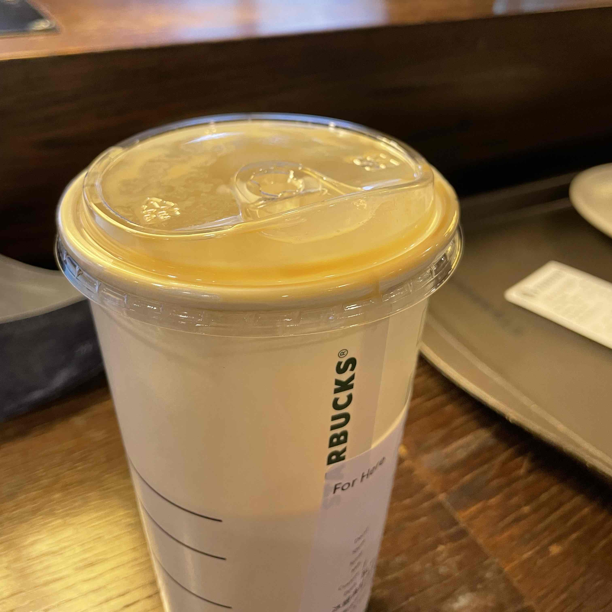

---
# https://gohugo.io/content-management/front-matter/
# https://jpanther.github.io/congo/docs/front-matter/
title: "🥤 星巴克的外帶杯真是越來越不行"
date: 2022-12-29T16:28:05+08:00
description: "這麼貴的飲料，杯子這麼爛是可以的嗎"
images: ["https://og-image.tomy.tech/%E6%98%9F%E5%B7%B4%E5%85%8B%E7%9A%84%E5%A4%96%E5%B8%B6%E6%9D%AF%E7%9C%9F%E7%9A%84%E6%98%AF%E8%B6%8A%E4%BE%86%E8%B6%8A%E4%B8%8D%E8%A1%8C.png?theme=dracula&md=1&fontSize=75px&images=https%3A%2F%2Ftomy.me%2Ftomy-circle-white.png"]
tags: ["🌟 產品體驗"]
---

作為星巴克版的長期潛水員，久久浮出來抱怨一下

## 前情提要

星巴克的外帶杯這幾年有經歷了幾波調整，我就寫我知道和有觀察到的部分，剩下的開放版友科普。

- 第一波應該是 2019 年開始，禁用塑膠吸管，所以杯蓋從原本的平口杯蓋改成現在的啜飲杯蓋。
- 第二波就是在疫情期間上架外送平台前，又對杯蓋做了新的防潑灑設計的修改 (具體差別我就沒特別注意)。
- 再來就是針對最近台北市開始禁用塑膠杯，所以塑膠杯全面改成新的紙杯。

目前的啜飲杯蓋確實有比之前的平口杯蓋蓋的緊一點，值得稱讚。但我本人沒有點過星巴克的外送，也沒有騎機車的習慣，是不是真的有防潑灑待版友補充。

紙吸管的部分我就不說了，就算不是星巴克，目前也還沒看到合格的。

接下來來盤點一下現行啜飲杯蓋缺點：

## 杯蓋開口

上面凸出來的點很小，所以非常難撥開。而且如果拿到飲料之後有晃動，基本上那個開口附近一定是沾有飲料的，不管我怎麼試，都很難在不弄髒手的情況下把開口撥開。然後如果你飲料喝到一半要帶著走，想說把開口暫時關回去，嘿嘿恭喜，接下來你再也挑不回來，除非你把整個杯蓋拿起來。

## 飲料殘留

因為上面飲用的開口有一個弧形突起，所以喝到最後一口的時候，飲料就會流到那個凹槽裡，除非把杯蓋打開，不然永遠喝不到。下次去星巴克不妨去回收台觀察一下，大部分用啜飲杯蓋的空飲料杯裡，幾乎全部都會不約而同的殘留一口。

## 打開杯蓋

也很困難。但考量到他本來就故意設計成不容易在外力衝擊的情況下打開，姑且不計較。在你好不容易把它打開之後，會發現杯子和杯蓋口周圍都會充滿一整圈殘留的飲料，如果不馬上吸乾淨，待會桌子就會搞的一團糟。

## 紙杯

紙杯跟塑膠杯有一個差異，就是紙杯會有一條直的接縫線，位置剛好就落在女神 logo 的正對面。換句話說，店員在做飲料時會把杯蓋蓋在讓 logo 朝外的方向，所以接縫處就會剛好落在杯口附近。但因為紙杯厚度的關係，杯蓋在這個接縫處會產生一個縫隙，一不注意飲料就會在飲用的時候滴出來灑到衣服上。

## 結論

坦白說，其他速食店、手搖飲料店飲料杯和杯蓋的問題也沒有比較少。但為什麼我選擇抱怨星巴克？因為台灣的星巴克定價明顯比其他國家高了非常多，但如果價格這麼昂貴的飲料，卻不能把飲用體驗這麼基本的事情做好，收這麼多錢，似乎說不過去吧。

以下開放版友補充自己的經驗
