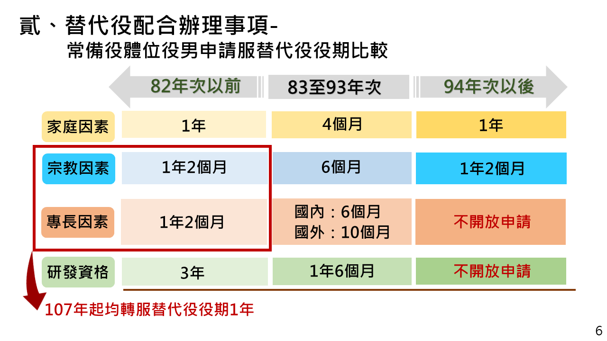
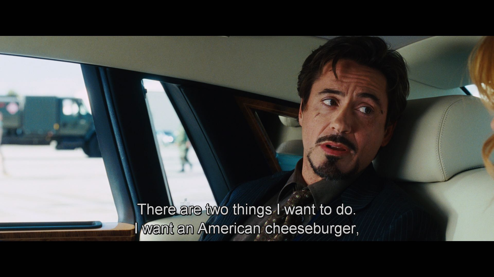
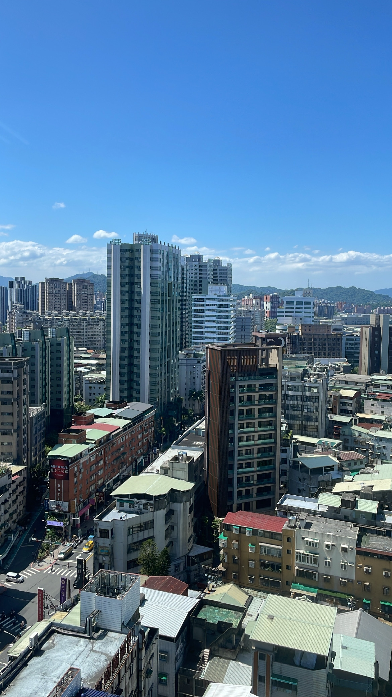

我的退伍日期剛好落在今年的 1/1，算一算也一個月了。寫一下我對這 3 個半月的所見所聞的想法

保密是軍人的天職，以下「事蹟」的部分 (新訓和消防署) 有約 20% ~ 50% 不等是我憑空杜撰的。如有巧合，不一定是雷同

## 制度

剛好在我當兵的期間遇到兵役延長為一年，為了幫助我以後回想，還有我的女性讀者 (不對吧，其實根本沒有吧 (摳鼻) 在這邊簡單介紹一下

我因為家人的關係，所以有申請到家庭因素替代役 (簡稱家因)。家因的由來就是役男有需要在家照顧家人的需求，所以可以在住家附近的單位服勤，然後每天返家照顧家人。坦白說，我覺得我其實不符合前面這個「理想」條件，但制度上來說，我是合法有這個資格的，自然也沒有什麼喬不喬的問題。

跟一般替代役 (抽的) 比起來，家因和宗教還有蠻多其他的好處：

|              | 一般                         | 家因、宗教                           |
| ------------ | ---------------------------- | ------------------------------------ |
| 役期         | 6 個月                       | 4 個月                               |
| 週間備勤地點 | 服勤單位 [^1]                | 在家 [^2]                            |
| 單位         | 在新訓期間依分數高低優先選擇 | 役政署安排通勤範圍一小時內的服勤地點 |

[^1]: 消防署的話是在[台北市替代役中心](https://goo.gl/maps/764Y9jwbd9DYAf8MA)，aka 前三軍總醫院廢棄病房
[^2]: 在規定中，返家是備勤，如果被抓到下班之後沒有在家，是會被處分ㄉ

因為家因和宗教替代役是「有緣由」的，所以這兩種的役期跟一般役一樣是 4 個月，但是還是要跟其他替代役一起進成功嶺進行 14 天的新訓。

另外 83~93 年次的役男不分役別都有最高 15 天的役期折抵，1 個學期的課可以抵 2 天，高中有 2 學期加實彈射擊 1 天，大學有 5 個學期，我修了 3 個學期，總共折到了 11 天。換句話說，扣掉在成功嶺的 14 天，我實際上在消防署只有待到差不多 3 個月而已。

至於教召的話，法律上是有，實務上 99% 沒有 (但還是有發生過)。但我想是與我無關啦嘻嘻

## 新訓

<!-- 新訓裡發生的鳥事太多了，忘了我大概也沒什麼好遺憾的，就不寫了。 -->

有些人可能會說，新訓就像夏令營一樣，就是進去玩 14 天。作為一個體驗過這個過程的人，我可以確定這是真的，但還是來補充一些背景和值得一提的細節好了。

新訓是替代役法律上有規定的一個環節，但其實沒有具體規範新訓應該涵蓋哪些內容，但因為替代役包含了像宗教替代役這樣的身分，所以和一般軍隊最大的不同就是「不碰武器」，把內容改成救災救護的部分，其中包含了 5 天的 EMT-1 緊急救護課程，但還是會有體能訓練的部分，只是我這一梯因為疫情少了一大半。另外在編制上，替代役役男和新訓中心是隸屬於內政部役政署，而不是國防部。

所以新訓實際上就是一群不是軍人的長官用模仿軍隊體制的方式在訓練人員。這個說法聽起來很奇怪，但是可以很好的解釋一些裡面的奇怪的規定和現象。最明顯的一點，就是表面上看起來，新訓還是在軍營裡 [^3]，沒有過的比較爽，但實際上可以看到很多隊長和長官帶隊都只是在演戲，就算大家走的亂七八糟其實也沒關係。

總之就想像它是國高中的隔宿露營、生活體驗營或是救國團營隊之類的，把好玩的部分抽掉，然後用值星官出來大吼大叫，沒事找事罵的環節取代，基本上就是替代役的新訓了。

[^3]: 實際上是國防部把成功嶺某個營區劃給內政部新訓中心，看起來像在軍營，但其實是軍營裡的一個小區域，我們活動的範圍也不太會和其他正式的軍隊單位重疊

出來的前幾天，幾個鄰兵在聊出去最想吃什麼，不知道為什麼，第一個浮現在我腦中的食物竟然是

> 漢堡王

撥交那天我爸開車來消防署載我回家的時候，我簡直就跟[鋼鐵人這幕](https://youtu.be/09KTGVpKN2U)一摸一樣 XDDDDDD

## 消防署

我在消防署被分配在資訊室，資訊室的工作一般來說只有三件事：

1. 送公文
2. 測試緊急通訊設備
3. 其他事項

前兩項雖然都有一些小細節需要上手，但真正讓人頭痛的是這個所謂的「其他事項」。比方說，在我被撥交到消防署前沒多久，[消防署的資訊機房發生了火災](https://udn.com/news/story/7320/6485129)，我聽到的時候也是傻爆眼，還以為消防署是全台灣最不會發生的火災的地方，沒想到[博恩夜夜秀](https://youtu.be/VYTD_s7Nt1g?t=365)說的都是真的 (x 

總而言之，雖然發生火災的是在 4 樓的資訊機房，但相關單位來徹查整棟大樓的時候，發現資訊室 17 樓的兩個管線機房裡面堆滿了一箱一箱的雜物 (目測約 300~400 箱)，不符合消防法規，所以清理這些雜物就變成了我們役男的工程。

真正低能的部分是，就算這些雜物絕大部分都是已經封好箱的公文和資料，因為銷毀的單位是按箱子數量算的，所以為了節省預算，我們得要一箱一箱拆開，壓縮空間再塞回去。但實際上也就只是 5 箱壓成 4 箱左右的比例，為了做這件事，我們的作業量應聲暴增了好幾倍。

在這邊要特別感謝我的同梯弟兄，在這方面幫我擋掉很多體力活，讓我可以在外面辦公室偷念托福

最後在接近我要退伍的時候，我們被調去南投訓練中心支援消防署的成果展，我們都戲稱這是我的畢業旅行 XDDDDD。但畢竟還是打雜工，所以鳥事自然也是沒少過，太細節就不寫了。

## 總結

如果撇掉免役不算的話，我當到的應該是台灣兵役史上數一數二的爽兵，時間短，事情不多，又可以每天回家躺，說實在也不該有什麼好抱怨的。

但在消防署我還是可以感覺到，很多人還是會把很多自己不想處理的雜事，全部丟給役男來做，即便那可能不是我們份內的工作。但追根究底，我覺得還是制度的問題，這些人不這麼做反而才是真的奇怪。

當然期間我也在閃掉了不少事，但我想我可以理直氣壯的說：

- 我不會閃那些，最後會砸到其他同梯的鳥事。或至少我會拉著弟兄一起閃，不會冷眼看著別人被砸到
- 我提供了我覺得 5 千多塊的薪水，值得的服務和水準，也許超過一點點，但絕對沒有太多

總結：閃躲飄即便不是在軍營，還是一項很重要的技能。

## 寫在最後

消防署的三個月對我來說，與其說是當兵，其實更像是接了一份短期打工，最重要的一點就是：作為一個實實在在的職場，我觀察到了一些我有點難以接受的現象。

新訓第一堂課都一定會介紹替代役在台灣的緣起：除了落實尊重社會多元需求之類的高大上理由之外，另外一個比較小，但不常被提到的緣由是：在科技日益進步的情況下，國軍不需要也沒空間編制過多的義務役軍人 (至少在當時是這樣)。

所以

如果我沒有搞錯

我們的政府，每個月只要 5 千塊，就可以請到一個可能原本要 5 萬塊的猴子，去填補某偏遠離島、人力不足、加給往上調也沒有人要去的消防局空缺。

比方說在消防署，每年有多到不行的預算，來建置一大堆有的沒有的系統、設備，卻還是每年源源不絕的從役政署要役男來打雜，更不用提招聘一大堆便宜的約僱人員來撙節人事預算。

更厲害的是，一群年輕人會排隊來搶這些機會，因為可以不用待在軍營裡，誰不想。而且礙於這個定位模糊的身分，政府可以要求他盡公務人員和軍人的義務，比方說闖禍了，可以用公務人員懲戒條例或是軍法處置，但又可以不提供任何權利和福利，因為他不符合任何一個身分。

台灣的低薪早就不是三兩天的問題，我也不是第一天認識這個問題，但真正讓我感到意外的是：我原本以為這件事的責任，80% 要落在資方身上。但實際上是，政府自己也在帶頭壓低薪資

**最可怕的是：每個知道這件事的人都在集體沈默、縱容這個現象發生**

去年我從歐洲回來台灣的時候，約了很多久沒見面的朋友吃飯。很多人聽到我之後會去美國念書，都直覺的問了我一個問題：「之後還會回來台灣嗎」

當時我剛從國外回來，那些以前習以為常的好處，在當時的眼中格外顯眼，所以當時的答案滿肯定的，有一天會回來，不管是畢業或是工作一段時間之後。

但才過了半年，現在的我反而不這麼確定了。
