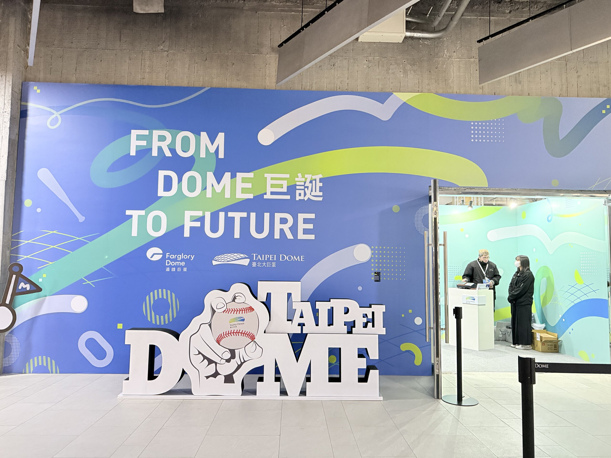

## 🧜🏻‍♀️ 星巴克

- 玫瑰蜜香茶那提變的好水好難喝，簡直連某些美國的妖魔鬼怪飲料都不如
- App 的行動預點太慢了，拜託改進一下
- 回收杯的這個想法挺不錯的，但塑膠杯子廉價感太強烈，似乎有損品牌形象
  - 但看完國外各種不環保的鋪張浪費，再回來看這整套系統，真是可愛的像個笑話[^1]
- 有些門市好像會開始積極處理顧客 (其實大部分應該是學生) 用物品佔位的行為，或許是件好事...嗎

[^1]: 其實這套陳述可以套在所有台灣的環保措施，但也確實就應該這麼做，這不是星巴克的問題。

## ☕️ 路易莎

- 去了象山藝文門市，坐落在信義區某高級社區的大廳，旁邊是藝廊，挺酷的
- 不管是飲料還是食物的價格好像都沒有漲太多，蠻意外的，值得嘉許

另外想討論一下最近路易莎因為驅趕罷免連署所以被抵制。

路易莎的長期政策好像一直都是降低產品售價，期待透過二次消費來提高營收。我看到 Threads 上有些人抱怨路易莎現在變的比圖書館還要像圖書館，因為總是坐滿在念書的高中生，但如果大家還記得的話，圖書館一開始存在的目的也不是提供學生念書的環境：）價格本來就是區分客群最直接的方式，作為消費的顧客，如果不希望周圍出現學生，那應該是我自己要選擇去價位比較高的咖啡廳，甚至如果是要辦公，就應該去共享辦公室，在咖啡廳裡大聲講電話我覺得甚至比安靜念書的學生還更差勁。但就憑這個現況去抹殺路易莎提供平價、優質顧客空間的社會責任，我覺得就十分可惜了。

作為一間要賺錢的企業，把價格帶壓低是有很多風險的，難以控制的問題會層出不窮，但如果消費者也回頭去圍剿這些公司導致他們無法生存，那失去的就是提供平價產品和社會責任的企業，我不覺得這是我們樂見的情況。

## 🥚 大巨蛋

所有跟大巨蛋扯上關係的人、事，不管是環評、古蹟、消防、疏散計畫、護樹團體、(其實沒)被保護的老樹、遠雄、北市府、趙藤雄還是柯文哲，似乎現在沒一個好過，台北市民晚了 10 年開始享用這顆蛋，前面提到的這些問題......似乎也沒有因為多花了時間而真的被解決，但就算時間倒轉，換個方式換個人，我左思右想也想不到這故事能有多好的結局。

歹戲是拖棚了，但大巨蛋終於還是啟用了。

這次沒排到時間進場看球或看表演，可能就留待未來吧，但是有路過一個台灣職棒的小展覽：

適逢經典賽奪冠，看著還是挺感動的，期待大巨蛋的啟用能為台灣的體壇再注入一股新的活水。

## 🏭 誠品松菸

也剛好大巨蛋啟用之後，從捷運站走去松菸再也不用繞一大圈了 (咦原來這是最大的優點嗎)

為了完美復刻誠品信義的各個區域，好像有些店面被收回去改裝成新的館。挺意外在台灣生育率不斷降低的情況下，兒童館居然還是保留了下來，我心心念念的音樂館，還有文具館的卡片角落也被完美復刻，真的是心滿意足了。

話說在美國看太多不怎麼好看的東西，回來什麼都覺得好漂亮，希望我的審美觀還有救 (唉)

## 🍟 麥當勞

麥當勞自從經營權賣給台灣之後搞了很多新菜色，也搞了自己的點點卡。上一次回來沒把裡面的餘額用光，就變成這次回來的一件雜事。

猜應該是全球政策統一，所以全世界大部分國家會共用一個麥當勞 App，而且規定原本各自開發的 App 都要下架，避免混淆。於是原本點點卡的那套就全部被搬到 Line 官方帳號裡，而且兩邊帳號資料沒有 (應該也是沒辦法) 互通。

所以身為一個資深~~肥宅~~麥當勞愛好者，你可能會同時持有：一個點點卡帳戶、一個外送帳戶、一個麥當勞 App 帳戶。

我真的是服了：）

## 🚄 高鐵

高鐵新的旅客資訊系統好像陸續上線了，車站的看板應該是都更新完了，部分車廂也開始換上新的資訊面板，看起來挺現代的，最可惜的應該是當時設計的時候沒有考量到延誤資訊，剛好最近回去頻頻發生地震，這方面的資訊似乎沒有呈現的太好。

另外，跟隨 JR 的腳步，磁條式的車票即將被 QR Code 取代。新聞稿是說這樣可以大福節省電力消耗，但明眼人都知道高鐵本身就這麼耗電的公司，進站閘門的耗電量根本就微不足道，我想真正的理由應該還是閘門維運成本的考量。

接下來幾年的大事件應該是

- 宜蘭、高雄、屏東延伸：家祭无忘告乃翁
- 新列車：據說好像跟日本談好了，猜應該會是 N700S 改成台灣的規格，挺期待的
- 票務系統用 15 年，一直沒這方面要更新的消息，也差不多該來了吧

## 🗿 忠泰美術館

歐洲逛完很多美術館發現博物館跟美術館其實不一定得是公共的，於是開始研究台灣有些什麼有意思的私營美術館。

於是這次就來了忠泰美術館，場館不大，但有種小而別緻的感覺。





<figcaption class="text-center">
  《臺灣建築的解嚴世代》：展出一些解嚴後建築美學的變遷
   
  沒想到前母校的教學大樓居然有入選 (!)
</figcaption>

另一個沒去到，但比較為人所知的應該是最近新開的富邦美術館，就留到下次再去吧

## ☂️ 共享雨傘、共享移動電源

共享移動電源其實也存在好一陣子了，原本我是相當不看好，作為無時無刻離不開手機的人，我出門一定是手機、錢包、鑰匙、行動電源四件套，很難想像跟我一樣的人為什麼出門不會自己多帶上行動電源這種東西，而且借了花錢，又容易忘記還，怎麼看都不像是會成功的商業模式。

但顯然我錯了，這次回來發現，這東西的使用率正在飛速的成長，顯然對大部分人來說，花點小錢買方便，何樂而不為。

再加上捷運站現在又多了共享雨傘，還有原本就相當盛行的 GoShare 和 WeMo，台灣真的是很成功了發揚光大了共享經濟的理念。

這讓我開始思考一種全新的商業模式：

1. 成立一間控股公司把這些共享類的產業全部收編，統一管理
2. 旗下所有服務改成全面免費
3. 賣廣告，讓廣告業主來支付物品和系統的維運
4. 還可以進一步針對物品的使用情形收集數據，把資料轉賣給顧問公司，用來做市場研究

比方說下禮拜 Netflix 要上新一季的魷魚遊戲，那就來買共享雨傘傘面的廣告，如果這禮拜台北市區剛好每天下大雨 (提示：其實非常常發生)，這廣告會鋪天蓋地的充滿台北街頭。

如果有人有資金和興趣歡迎找我當合夥人 (揮手

## 🛍️ 新百貨

今年會是台灣百貨業的新一波汰換潮，蠻多令人期待的新花樣，可惜我都逛不到 QQQQ

- 誠品信義掰了，全世界少數的 24 小時書店，即將被換成統一的 Dream Plaza，內含亞洲最大間的星巴克。吳清友在天上看著這件事的發生，感覺祖墳都要冒青煙了。[^2]
- 敦南 Sogo 也掰了，跟敦南誠品差不多，都更完會變豪宅。看樣子敦南這一小區的百貨應該是會漸漸消失，往忠孝復興和忠孝敦化兩邊靠攏，說不定 Sogo 復興館旁新的 DIAMOND TOWERS 會有機會遞補這部分的空缺也說不定，但兩間我都沒逛過，不是我的領域，瞎猜的
- 微風的新據點幾乎都表現平平，本館也沒太多創新，但似乎仍屹立不搖。據說這間能持續存活是因為能夠專注持續服務少數的大客戶來維持業績，似乎變相印證了台灣的貧富差距其實還是存在的 (?) 私心覺得不是一件好事。
- 101 的新董座賈永婕新官上任三把火，雖然看似是名門內卡，但我是真心覺得她對百貨經營是有點想法的，期待接下來的發展
- 大巨蛋的百貨由遠東集團標下，經營會如何不知道，但從「Garden City」這名字還有目前放出來的各項行銷文宣，我大膽猜測這經營團隊的平均年齡至少有 40 歲，也證明遠東在百貨經營這塊依舊是多頭馬車，各分店各自為政
- 南港 Lalaport 要開了，據說還會有 KidZania，用來填補以前京華城的 BabyBoss (完了老人臭飄出來)。之前 BabyBoss 收掉是一個很有趣的案例，有興趣的人可以去查查新聞，這裡不贅述，我會挺期待看看新的 KidZania 會用什麼商業模式經營下去
- 我以為威秀在對面遠百開了新的 Muvie Cinema 之後，可能就會把原本的兩棟舊影城都更，畢竟在這寸土寸金的信義區，存在兩棟只有三層樓高的平房，土地綜效實在太低了，但沒想到去看星際效應的時候，居然發現影廳居然還有在大整修，應該代表短期內這地方沒有要收掉，其中一些比較小的廳甚至改為金馬影廳，專門放藝術類相關的電影，真是挺驚嘆的

最後補充一點是，台灣的百貨零售似乎在線上體驗這點都做的不怎麼樣，有些有網站、有網購、有 App、有會員、但整體而言，作為消費者，我實在看不出這些雜亂無章的東西，到底能怎麼樣提升我的消費體驗。說難聽一點，我如果做個 App 讓大家查哪間百貨幾樓哪裡有廁所可以棒賽說不定下載量都會比這些垃圾好：）

同上，如果有人有資金和興趣在這領域創業，歡迎找我當合夥人 (揮手

[^2]: 題外話：分享一下[Open 小將換女友的故事](https://www.pttweb.cc/bbs/C_Chat/M.1738291314.A.C58)，我真的笑瘋

---

為什麼一開始只是想隨筆一下，居然洋洋灑灑寫了三千字（？？？？

Anyway，就醬，台灣的朋朋們明年再見 👋🏻
