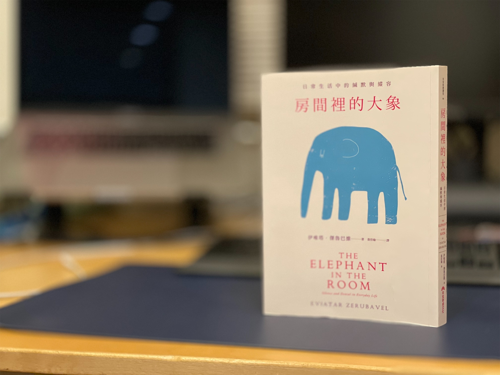

《房間裡的大象》，源自英文俚語 [The Elephant in the Room](https://en.wikipedia.org/wiki/Elephant_in_the_room)，指的是某個議題因為太過爭議，導致即便問題已經大的荒謬，人們依舊選擇假裝這個問題並不存在、拒於討論。

常見的例子，比方說《國王的新衣》中群眾集體讚頌國王的新衣非常華麗，或是二戰時期的德國人會避免討論關於離開的猶太人都去了哪裡。

這本書深度解析了人性在面對這些複雜的爭議時，採取的選擇、反應，並解析為什麼人們會集體「串謀」，讓謊言持續傳頌下去，以及你可以怎麼做，來終結這個荒謬的僵局。

## 👁️‍🗨️ 辨識大象

即便這個概念聽上去適用空間很狹窄，但是作者對於這個現象的闡述很豐富，遠多過於後面的部分，但我對這部分比較不感興趣，這裡就不贅述。

簡單快速的判斷指標：當你覺得難以暢所欲言，對於開口時的用字需要步步為營，或是這個環境在無聲時比有聲更令人不適，那這個環境也許就有公開的秘密正在流竄著。

## 💥 終結串謀

在確定問題之後，這本書也給予了一份指南，來教你如何扭轉這樣的局面。

1. 🫵🏻 指出房間裡的大象

第一步，最重要的就是要把問題指認出來，俗話說的開出第一槍。

這個步驟的重點在於把大家都知道的問題攤在陽光下，一方面可以會使得大家更難以繼續裝作沒看見這個問題，另一方面也創造出這個議題的討論空間。

2. 取個名字利於討論

難以啟齒的問題容易使人卻步，所以當現象級的問題需要被搬上檯面時，取名字是一種常見的做法。這麼做的目的在於緩解討論議題的摩擦力，也更能夠加深群眾印象，讓大家體現到問題是存在的，而且需要被改變。

比方說 Black Lives Matters 或是更近期一點的 #MeToo

3. 旁觀者的協助...還是挑戰?

挺身揭露需要勇氣，或許不是每個人都能在事件的當下成為發聲者，但身為旁觀事件的第三人，也同樣扮演著重要的角色。

在《國王的新衣》裡，一開始國王出巡時，大眾都還保持著裝聾作啞的態度，直到那個指出國王一絲不掛的小孩出現，群眾中才開始出現了些許的雜音。

而困難現在才正要浮現，在一片嘈雜的聲音中，也不免會出現「小孩子懂什麼」或是「國王的英明不可褻瀆」等言論，這些**指責吹哨者可信度**或是**模糊焦點**的言論，都會對試圖改變現狀的努力造成極大的傷害。

這或許會是這本書帶給我最大的啟發：

> **也許當下的你選擇沈默，成為共犯。**
>
> **但不代表在情勢有所改變時，仍要繼續扮演隱匿證據的幫兇**

如果這個時候，旁觀的人群沒有聲援或是附和這個小孩的說法，這個小孩只會被「懂事」的大人帶回家教訓，而未來更愚蠢的事情發生時，越來越少人會願意跳出來當第一個指控的人。

4. 累積壓力

即便眾人已經開始訕笑，但國王也清楚的知道，身為這場表演的主角，他必須繼續讓這齣戲演下去，因此維持一貫的自傲，堅決否認，成了他最好的選擇。

這時，突破困境最好的作法反而是反轉並利用這個困境——吸引夠多的旁觀者加入促使改變的一方，讓原本壓抑不去戳破的力量，轉而施加在堅決忽視的人身上。久而久之，輿論就會升累積到當事人不得不正面回應的臨界點，而就是在這個時間點，問題才能開始被有效的解決。

## 🫢 例外

也是有很多時候，不需要把所有的事情都攤在陽光下。

比方說事情小到微不足道，公開指出沒有好處的時候。假設在某個非常正式的商務聚餐，有人一直叫錯名字，或者更糟，放了一聲響屁，這時候也許在場的人集體「忽視」這些尷尬的情境，會讓場面不這麼難堪。減少摩擦，是讓社會運作更「順暢」的關鍵。這也是值得反思的問題，為求讓社會更順利的運行下去，什麼樣的問題是微不足道、可以被忽視的？

## 💭 結語 × 閱讀指南

這本書應該是 2 月的某個晚上，在誠品松菸意外翻到的。

當時翻到這本書，對這個議題還算有點興趣就買回家了，可惜過了序言之後，這本書的前 4 章都在討論這個現象的成因，還有剖析大眾心理，讀起來稍嫌沈悶，所以讀起來進度非常緩慢。[^1]

但快轉到 5、6 月，這本書讀起來就不一樣了。因為台灣社會新聞的年度史詩大戲 #MeToo 運動正好開始連載，這時候讀到第 5 章，也就是如何打破的部分。

可以在新聞上看到某些人，真的如書上所說的做出了某些反應和舉動，感到有趣之餘其實也挺恐怖的，因為作者還會一一剖析這些反應背後的動機，以及他們想要達成的意圖，就像照妖鏡一樣，但照出的不只是當事人的醜陋，連在場沈默的共犯也都會逐一現形，甚至連講述事件的新聞媒體本身也無法倖免。

所以，如果你不信任媒體對 #MeToo 事件的刻畫，這本書或許會是提供你另一種思考的明燈。

By the way 最近身邊社科所的同學正在發起改善性平的連署活動

👉🏻 有興趣的話可以在[這裡](https://forms.gle/NwJXPJbGDfFA7uz78)參與連署。

> **終結串謀比串謀本身 更具威脅性**

[^1]: 還有就是我出去度假了 ♪~ ᕕ(ᐛ)ᕗ 這本書被我無情遺忘在台灣 XDD
