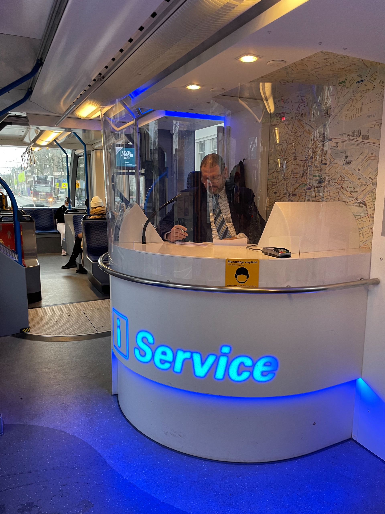
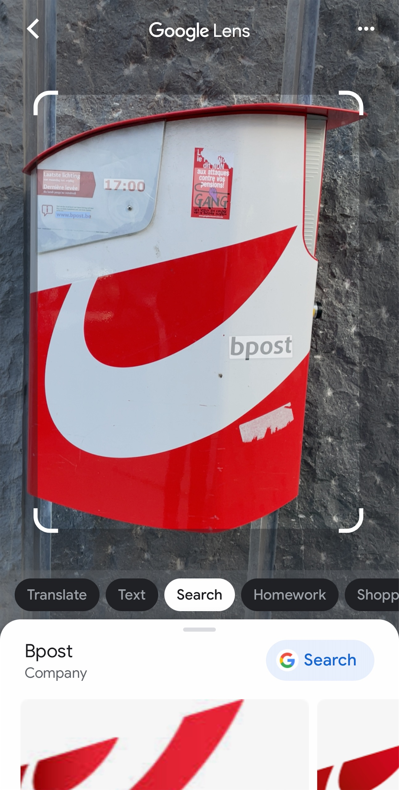

[上一篇]()的例子比較多是客觀的狀態，這一篇來討論我主觀的感覺吧

## 🚇 簡單、便宜、直覺的大眾運輸

去年交換的期間走遍了很多歐洲城市，當我新到達一個城市的時候，都一定會立刻遇到一個問題：「要怎麼搭乘大眾運輸工具」。

這個城市提供哪些交通工具？要怎麼買票/搭乘？


    
    

<figcaption class="text-center">德國的 U-Bahn (捷運) 沒有驗票閘門，上車前自己買票、打票，一切講求誠實 對外地人來說，你要在被查票的時候才會發現你買的票是錯的，然後被收好幾倍的罰款</figcaption>

<figure>
    
    <figcaption class="text-center">在荷蘭搭乘輕軌，有時要事先在月台上的售票機買好票，有時要上車後找後面的售票員買 但是如果你剛好在一個沒有售票機的站上了一個沒有售票員的車，該怎麼辦呢？ 這個問題直到我離開都還沒解開 ¯\_(ツ)_/¯</figcaption>
</figure>

還有像是公車要從哪一個門上車，有些公車沒辦法投現要怎麼辦？

買一日票或多日票會不會比較方便？但會不會實際上想去的景點大部分捷運都沒有到，或是不好用？

直到到了倫敦，才見識到什麼叫做世界級的大眾運輸系統：

大倫敦地區有地鐵 (Tube, Underground)、公車、輕軌 (Tram)、地上鐵 (Overground, DLR) 等各式各樣奇形怪狀的交通工具，但它們全部都歸 TfL (Transport for London) 管轄。


    
    

<figcaption class="text-center">左：駛過倫敦塔橋的招牌紅色倫敦公車 右：倫敦的地鐵其實不全然是在地下，而地上鐵也不完全是在地上</figcaption>

TfL 的這套系統厲害的地方就在於：

- 不用現金 (當然這個選項並沒有消失)
- 不用排隊買票、買儲值卡 (Oyster Card)
- 使用者會自動獲得最優惠的價錢
- 使用信用卡支付交通費會自動獲得信用卡公司提供的旅平險

在所有需要進出、付款的地方，看到感應的閘門，只要拿出你的信用卡 (或 Apple/Google Pay) 直接刷進去就好。系統會在當天結束的時候自動計算你今天搭乘了哪些交通工具，如果你搭了超過一日票的錢，系統只會收你一日票的錢，週票、月票同理，因為 TfL 鼓勵大家多使用大眾運輸系統。

所以即便你語言不通、數學不好、剛下飛機沒有英鎊現金都沒關係，**只需要一張信用卡，任何人都可以暢行倫敦**。

## 🇬🇧 英語普及度悖論

<figure>
    
    <figcaption class="text-center">也許你知道 Google 翻譯可以翻譯照片上的文字 但你知道 <a href="https://lens.google/">Google Lens</a> 可以告訴你某個物件是什麼東西嗎 舉凡不知道是在賣什麼的店、或是包裝看不懂的飲料都可以哦 XD</figcaption>
</figure>

關於英文的普及度，其實處於兩種尷尬的極端。

像巴黎就是一個很特別的例子。法國因為自身政治、經濟實力不容小覷，所以在巴黎雖然英文不會到不能用，但偶爾遇到英文不通的人，你還是會在空氣中嗅到他在透露「法文才是王道」的感覺，類似的案例，我覺得東京也有一點類似的感覺。

其實某種程度上並沒有錯，在別人的地盤，學習別人的語言和規則本來就是天經地義。

但另一種極端，就是在其他~~不這麼霸權主義~~的國家，遇到英文不通的人，他們的表情時常就顯得的「不好意思」一點，如果不認真思考這個問題的時候，當然也就容易跑出「X 的我到底來到什麼____國度」。

所以這樣看下來，英文通不通到底能不能作為一個地區有國際化的指標呢？

我覺得天秤的兩邊，都應該更往中間靠一點。增加英文的普及度是一件事，認同自己的語言是一件事，包容其他的語言和文化又是另一件事。

期待 2030 雙語國家的台灣，思考會再更周全一點。

## 🧧 本地文化

上一篇提到國際化的一大特色就是文化大熔爐。但熔爐裡裝的當然不只是異國文化，本地文化也是很重要的一環。

### 📛 珍惜自己原本的名字

<small>題外話：有人知道 📛 這個表情符號是名牌嗎 xDDD</small>

台灣人小時候學英文，幾乎都會取一個英文的名字，這些名字有多奇怪我就先不說了，但是相反的，很多外國人在學中文以外的外語的時候，其實不太會做這件事。特別是在歐美這種強調個體性的文化，對他們來說，名字是代表自己和背後文化一個非常重要的特徵，所以當然不會隨便的放棄。


<figcaption class="text-center">剛好最近 YJ 的日本留學影片也有討論到這件事 (10:50 處)</figcaption>

### 🎑 傳承

某種程度上來說，一個城市的國際化程度也可以反向的，透過在地文化如何傳承來被印證。

在交換的期間我發現一個很有趣的現象：台灣過傳統節慶的習俗正在漸漸的淡化，也許中秋節大家會記得烤肉，但什麼端午節要掛艾草、香包之類的根本已經快消失了。但人在海外的華人，反而會更認真的在維繫自己這些傳統的習俗。

反過來想，我想國外的節慶習俗之所以可以被保存的這麼好，也許也就是因為國內有太多的外來人口，所以當地人要介紹自己的文化給新移民，這些文化習俗就會不斷的被重複提起，也就更不容易消失了吧。

所以身為台灣人，也許你可以試著想想看，你會怎麼介紹清明、端午、中秋節給外國人呢？

<small>我自己是發現這個題目就算用中文，我也可能會回答的亂七八糟哈哈哈哈</small>

## 🧑🏻‍⚕️ Misc

這篇文本來是要昨天出的，但是寫到一半被睿哲抓去諮詢他的 MSD 面試

那我只好在這裡祝他順利上岸囉 XDDDDD
