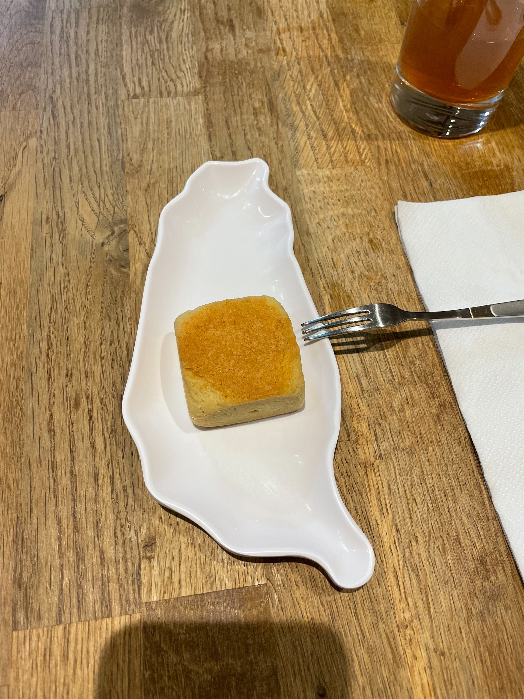
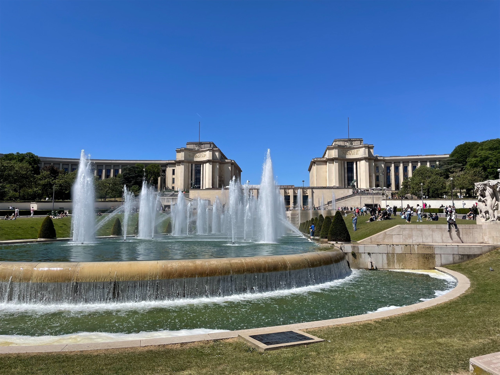
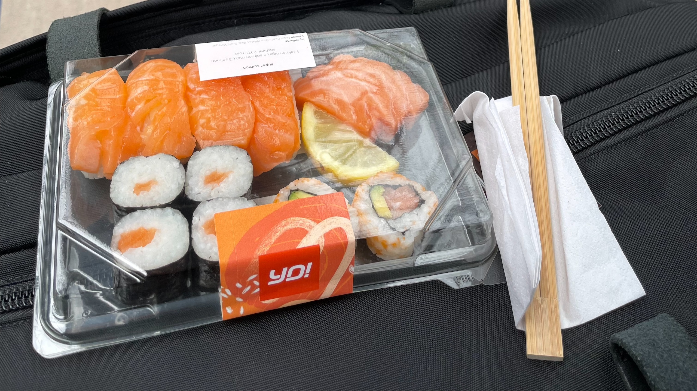

想寫這篇文章的原因來自於我去年造訪倫敦前看到的一支影片：



> 你一定要試試倫敦的咖哩，這是英國最熱門的食物。
> 
> 倫敦擁有全世界僅次於印度最棒的印度餐廳！

才驚覺，對欸，我以前怎麼會沒想過，一個地方的食物到了新的地方，也會經過演化，成為一種全新的料理。就算是印度人來倫敦，應該也會對英國的印度餐廳躍躍欲試吧，就像我在法國也試了一些在法國的台灣料理。

的滷肉飯")

 融合法式料理創意的台灣刈包")

## 🌈 NPC 的多元性

去年的法國交換，有經過 Trocadéro 廣場，這個廣場位於塞納河右岸的高地，左岸就是艾菲爾鐵塔，所以是很多死觀光客會來拍照的景點。那時候對鐵塔沒什麼驚艷的感覺，但是坐在廣場邊吃可麗餅的時候才漸漸產生一種，好像全世界的人都聚集在這裡的感覺。

就是左邊有一群中國人在拍照，右邊有一群印度媽媽牽著三個小孩跑來跑去，遠方可以看到黑人在跳舞，旁邊就是東京宮，所以日本人也少不了。而且時不時路過一群路人在聊天的時候，會發現我明明已經去過蠻多地方，見過蠻多不同地區的人，但我卻還是沒辦法靠外表、穿著、口音甚至語言來猜他可能來自哪裡。

後來有次我在倫敦的地鐵上，看到有英國上班族在教對面的穆斯林怎麼搭地鐵，這所謂「國際化」的感受就會很突然的湧上來。

## 🥑🍣 飲食文化大熔爐

就像披薩是發源於義大利，但在台灣當我們講到披薩的時候，我們腦中浮現的披薩，可能往往是像必勝客或達美樂那種鬆厚餅皮的美式披薩，就算不討論鳳梨到底能不能放在披薩上，最正統的義大利披薩其實更接近薄餅。

在歐洲的期間，也目睹到了一些神奇的食物。除了上面影片提到僅次於印度最棒的印度餐廳外，另一個例子是壽司。

我在從曼徹斯特要前往倫敦的火車發車前，就在車站隨手買了一盒綜合壽司。迫於當時時間太趕了，我沒有認真看我到底買了什麼，直到上車才發現，這壽司中間綠色的部分不是小黃瓜，而是酪梨，我腦子裡馬上出現一個日本人出來：「え~~~~~」。

去過日本這麼多次，我還真沒看過酪梨壽司。我也是到後來才知道原來有一種壽司叫做[加州卷](https://en.wikipedia.org/wiki/California_roll)，但其實我還是不知道怎麼分辨花壽司和加州卷 XDDDDD

總之，就像我在泰國待了 20 天都沒吃到月亮蝦餅，在台灣活了 20 幾年也沒聽過[台灣拉麵](https://zh.wikipedia.org/wiki/%E5%8F%B0%E7%81%A3%E6%8B%89%E9%BA%B5)，飲食本來就是一種很容易~~突變~~演化的文化，所以從那之後，旅行除了嘗試當地料理，我也會稍微觀察一下當地提供的異國料理是長什麼樣子。

## 🎬 下集待續

突然發現有好多可以寫的點哦，那我們[下集]()見！
