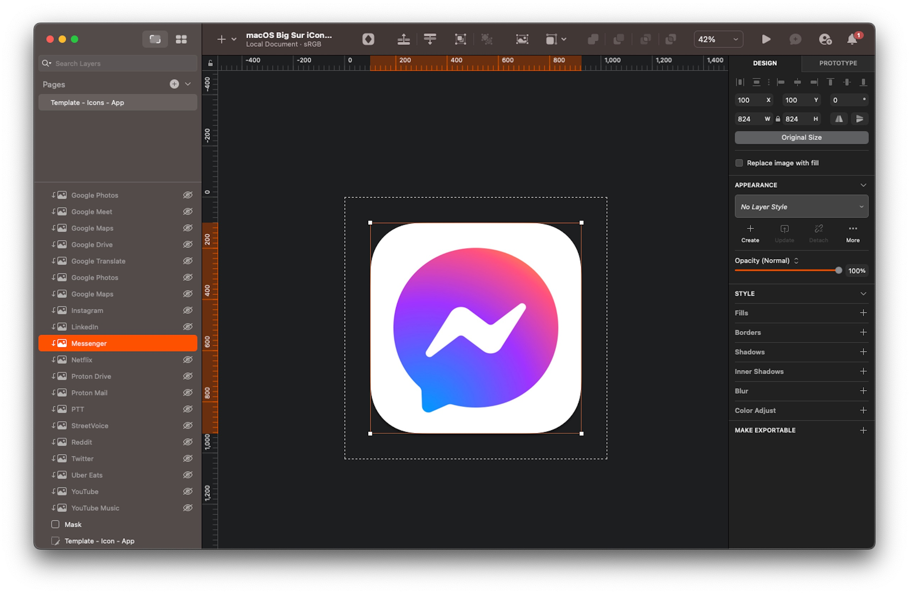

繼[上一篇]()講完了 Web Apps 的起源和在手機端的故事，讓我們再拉回電腦端的 Web Apps。

在蘋果宣佈回歸 Web Apps 之前，Google 早在 [2020 年](https://web.archive.org/web/20200306015245/https://support.google.com/chrome_webstore/answer/3060053)就在 Chrome 上支援這項功能了 [^1]，而這也是我過去這幾年主要使用的方式，所以接下來會以 Chrome 來示範操作，但概念是互通的，理論上就算是別的瀏覽器也可以做到。

[^1]: 以前有一個東西叫做 Chrome Apps，就是使用者可以在 Chrome Web Store 上下載 Apps 放到 Chrome 裡面用，他的底層是透過 Web Apps 來實作的，但是這個東西已經被 Google 砍掉了，故本文不討論。

## 📦 安裝 Web Apps

你可以依照你常用的瀏覽器來安裝 Web Apps：

- Chromium 核心的瀏覽器 (Chrome, Edge, Brave...等)[^2] 可以按照 Google 的這份[指南](https://support.google.com/chrome_webstore/answer/3060053?hl=zh-Hant)
- Safari 要等新的 macOS Sonoma 推出才能使用，但是你可以偷看一下[實際操作的影片](https://www.youtube.com/live/GYkq9Rgoj8E?t=3303)
- Firefox 本來有這個功能，但他們把他[拔掉了](https://bugzilla.mozilla.org/show_bug.cgi?id=1682593) QQQQQQ

好啦現在你知道為什麼我要用 Chrome 來示範了吧 😂😂

這邊來補充一個小撇步

### 🔗 客製化主頁連結

以 Facebook 的 Messenger 為例，這個網頁的主要連結是 https://www.messenger.com，當瀏覽器載入這個連結的時候，網址會自動被修正為現在聊天清單的第一個聊天室，以我現在的聊天室來說，就會跳轉到 https://www.messenger.com/t/2028991214079769 也就是薩泰爾娛樂的聊天室。如果我在這個時候建立 Web Apps，那我的 Web Apps 就會以這個聊天室作為主要連結，所以每次打開都一定會跳到這個聊天室。

這時，我們可以按右鍵 →「檢查」→ 在開發者工具上方的分頁中找到「Console」，然後在這裡面輸入這個指令：

```javascript
window.history.pushState({}, "", "https://www.messenger.com");
```

這個指令只會做一件事：在不重新整理網頁的前提下，把連結修改成我們要的樣子。請注意直接修改網址列的網址不按 Enter 是沒有用的，所以才要用這個方法。

好啦我知道還是有人會覺得很困惑，所以還是來影片支援一下：



修改完連結之後就可以照原本的步驟安裝 Web Apps 囉！

[^2]: Arc 是使用 Chromium 核心，但是他們把這個功能拔掉了，所以不支援 Web Apps

## 🏵️ 更換 Icon

像 iOS 和 Android 都有一些既定的設計風格可以遵循，所以視覺上看起來比較統一、舒服。而到了網頁端就沒有這麼嚴謹的規範，所以 Icon 通常就會長的比較五花八門一點，這時就可以考慮來幫 Web Apps 換上更貼近其他系統程式的 Icon。

以下我以 macOS 示範，但是 Windows 也可以按照類似的方式達成

1. 在[蘋果官方的開發者網站](https://developer.apple.com/design/resources/#macos-apps)上找到 macOS 的 Icon 藍圖
2. 通常這些 Web App 都有原生的手機 App，所以可以從它的手機 App 網頁上取得完整的 Icon，通常我會用[這個網站](https://bendodson.com/projects/itunes-artwork-finder/)來取得解析度比較高的 Icon
3. 搭配前面的藍圖，把 Icon 切出圓角



如果這個操作太騷了你做不來，另一個簡單的方式是上 [macOSicons](https://macosicons.com)，這裡有各式各樣的 Icon 可以下載

4. 最後在 App 上點右鍵 → 「取得資訊」，然後把做好的 Ionc 拉到原本的 Icon 上覆蓋上去
5. 然後就是...Do Re Mi So 🪄





<figcaption class="text-center">這樣看起來明顯舒服多了吧 😌</figcaption>

最後提醒一點：記得把新的 Icon 備份起來，以防 Chrome 會時不時的把網站原本的 Icon 套回來

## 🎬 下集預告

這一篇討論了 Web Apps 的初步設定，[下一篇]()會進一步延伸到優化各個網站的操作細節，敬請期待 😆
