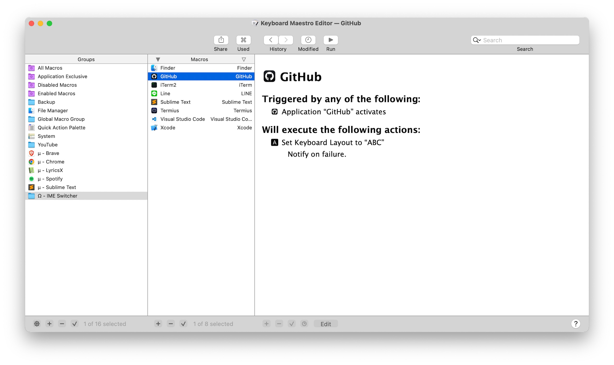
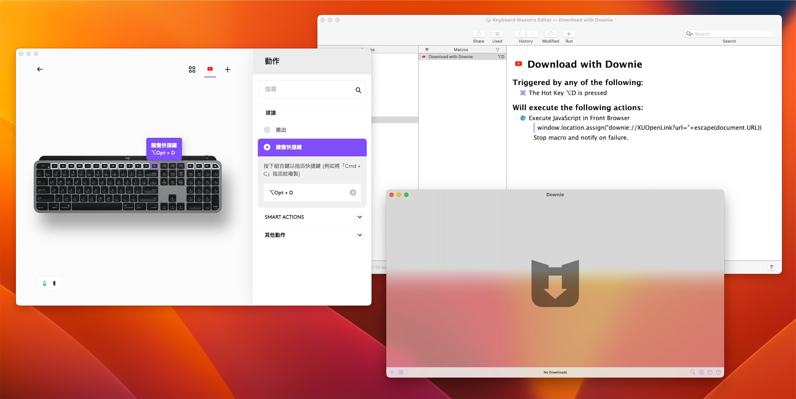

在[上一篇]()，我們把我們想封裝的 Web Apps 打包好了，這一篇要進入最精華的部分：優化操作體驗。

## 🤔 緣由與原理

在進入正題之前，先來解答很多人在讀到上一篇的時候可能會想到的一個問題：

> 啊我在瀏覽器裡操作這些網頁好好的，為什麼沒事要把他封裝成 Web Apps？

其實並沒有錯，網頁並不會因為被封裝成 Web Apps 而在功能上有太大的改變。但對作業系統來說，Web Apps 是一個獨立於瀏覽器的存在，也正因為這個特質，讓我們可以在這個基礎上去改變操作 Web Apps 的方式。

聽起來可能有點抽象，來舉個例子：

假設我現在要在 Google Docs 上寫一篇文章，通常我會同時打開維基百科、其他網頁、還有其他在電腦上的 PDF 文件或應用程式來當作參考資料。因此在寫文章的時候，我會透過 <kbd>⌘</kbd> + <kbd>Tab</kbd> (或是 <kbd>Ctrl</kbd> + <kbd>Tab</kbd>) 頻繁的來回切換的這些視窗。但是在切換的時候，Google Docs 就是瀏覽器的一部分，因此不管我怎麼切換，我都會需要使用滑鼠或其他快捷鍵來完成切換回 Google Docs 的最後一哩路。

此時，如果 Google Docs 已經被封裝成 Web Apps，作業系統就會把 Google Docs 視為一個獨立的 App，所以在切換的時候，目光就可以快速的定位回到寫作的狀態。

另外一點就是增加使用時的沈浸感，換句話說就是增加使用時的摩擦力，對於工作的效率也會有不容小覷的影響。這個原理其實跟[《原子習慣》]()中提到的非常相似：**減少摩擦力會有助於從事困難的事務**。

 不會被淹沒在瀏覽器的堆疊中 (紅色箭頭) Windows 上同樣的功能叫做工作檢視，就是在開始鈕旁邊點下去會看到所有視窗的那個")

## 🖱️ 滑鼠側鍵

如果你的滑鼠剛好有側鍵，通常廠商會提供軟體來讓你客製化這些側鍵的功能，但這些軟體最大的缺點就是只能夠針對個別應用程式設定，一般是沒辦法針對某一個網頁來客製化的。因此，Web Apps 就給了你客製化網頁的機會。

最簡單的方式就是透過鍵盤快捷鍵。比方說，你可以在[這裡](https://support.google.com/youtube/answer/7631406?hl=zh-Hant)找到所有的 YouTube 快捷鍵

找到想用的功能，這裡我用的有：

- 兩個側鍵分別可以用來倒轉/快進影片 5 秒：<kbd>←</kbd>、<kbd>→</kbd>
- 中鍵則可以開啟/關閉劇院模式：<kbd>T</kbd>

")


<figcaption class="text-center">最後操作起來大概就會長這樣</figcaption>

兩個側鍵的組合最常用的配置就是：

- 前進 / 後退 (瀏覽器紀錄、影片)
- 復原 / 重做 (<kbd>Ctrl</kbd> + <kbd>Z</kbd> / <kbd>Ctrl</kbd> + <kbd>Shift</kbd> + <kbd>Z</kbd>)
- 上一頁 / 下一頁

這裡再提供一個比較不一樣的例子：Google Meet。我在官方的[鍵盤快捷鍵](https://support.google.com/a/users/answer/9896256?hl=zh-Hant)指南裡發現其實 Google 有蠻多內建的鍵盤快捷鍵，最後我設定了：

- 側鍵 (1)：開啟 / 關閉麥克風 (<kbd>⌘</kbd> + <kbd>D</kbd>)
- 側鍵 (2)：舉手 / 把手放下 (<kbd>⌘</kbd> + <kbd>⌃Ctrl</kbd> + <kbd>H</kbd>)
- 側邊滾輪：調整電腦音量

通常滑鼠廠商的軟體都會原生支援像 Cisco WebEx 或是 Zoom 這種獨立安裝的 App，但因為 Google Meet 是網頁的，所以就只能自己~~家庭代工~~手動設定了。

## ⌨️ 鍵盤快捷鍵

也許你的滑鼠沒有側鍵，但同樣的套路也可以應用在鍵盤上！而且因為按鍵變得更多了，所以可以設定的玩法又更加多元。

邏輯跟上面的滑鼠快捷鍵一樣，只是把快捷鍵改成鍵盤快捷鍵而已。這裡就不多贅述

如果你用的是~~夜市 100 塊的~~便宜鍵盤，沒有附軟體可以修改，可以搜尋一種叫做「按鍵精靈」的程式，裝了以後也可以達成一樣的效果，但那部分就留給有需要的人自行探索囉

## 📝 小腳本

延續上面講到的「按鍵精靈」，這類的程式也可以用來幫 Web Apps 錦上添花。在 Mac 上可以用 Keyboard Maestro 來達成：

但是這些設定起來有點複雜，就留給有興趣的人當回家功課囉 😜

## 🌈 結論

總之，Web Apps 被抽離瀏覽器之後的玩法非常多元，只要你的工具軟體可以針對應用程式客製化，就可以把同樣的作法套在 Web Apps 上。

那就祝大家玩得愉快囉，有興趣的也可以私訊我分享你的玩法哈哈哈哈
