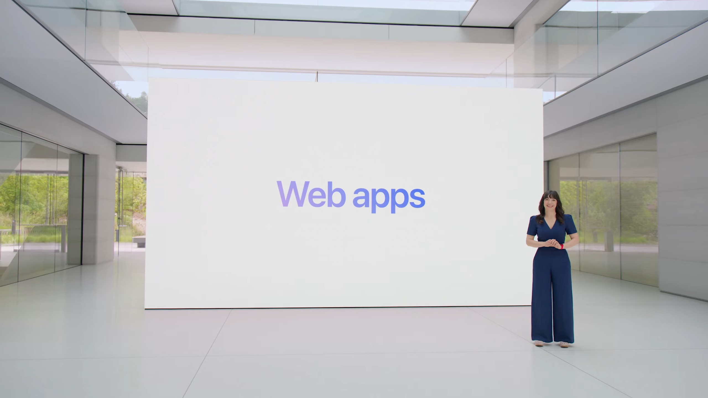

最近在整理瀏覽器的設定和環境，回頭一看發現我安裝的 Web Apps 已經被我改到不輸原生 App 的體驗了，不如就來分享一下 Web Apps 這個酷酷的功能吧！

## 📜 Web Apps 的前世今生

說起 Web Apps 的誕生，我們必須回到 WWDC 2007：

當時 iPhone 第一代剛發佈不到半年，此時的 iPhone 還沒有 App Store，所以使用者能玩的功能完全受限於蘋果所提供的內建 App，唯一的例外就是使用 Safari 到某個網頁執行某些特定的功能，比方說網路銀行，或上 Amazon 血拼。

於是蘋果就想：那不如我們就幫 Safari 加上一個「存到桌面」的功能吧！於是 Web Apps 的概念就這麼誕生了。

的呢")

所以 Web Apps 顧名思義就是把網頁 (Web) 封裝成 App。跟原生 App (在 App Store 裡下載，或是從網路上載下來安裝在本機的 App) 最大的差別在於他就是網頁，只是被瀏覽器封裝起來而已，雖然運行的方式有很大的不同，但兩者在不同方面還是各有優劣：

|      | 原生 App                                 | Web App                                  |
| ---- | ---------------------------------------- | ---------------------------------------- |
| 安裝 | 下載後安裝到本機                         | 不用下載、不用安裝                       |
| 使用 | 從本機開啟，可以離線執行                 | 每次開啟都會連到網站上進行任何操作       |
| 更新 | 再下載安裝一次                           | 每次使用都是最新的版本                   |
| 安全 | 可能會在系統上執行任何奇怪的程式         | 受限於瀏覽器，沒辦法亂搞電腦             |
| 功能 | 在作業系統的允許範圍內，可以達成任何功能 | 有些系統才能提供的功能，瀏覽器可能不支援 |

<figcaption class="text-center">以上這些都是「大部分」情況，僅供參考</figcaption>

可惜好景不常，只過了不到一年，蘋果就決定改為全力推動原生 App，隨著 App Store 的發布，雖然這個功能依舊存在，但已經漸漸的被大家淡忘，可以說 Web App 的車才剛發，就已經翻了 (笑

在那之後，網頁開發的技術不斷迭代，後來甚至成長出了 [PWA](https://noob.tw/why-pwa/) 這樣的生態系，但那部分有點太技術了，我也沒那麼熟悉，所以有興趣的人就...自行移駕唄。

身為使用者，只要知道：

- 現在的 Web App 比以前更接近原生 App 了 🎉🎉
- 因為 Apple 會嚴格審查每一個上架到 App Store 的 App，所以 Web Apps 是一個繞過這個限制的好方法。

在 WWDC 2023 中，除了發布貴參參的~~高科技潛水護目鏡~~  Vision Pro 之外，蘋果終於決定把這個 iOS 獨佔了 16 年的功能帶回 macOS，應該也可以說是 Web Apps 與 Safari 的多年之後在彼岸的另一端重逢吧。

## 🎬 下集預告

[下一集]()進入實戰篇，來聊聊可以怎麼設定 Web Apps，讓使用體驗更接近原生 App！
