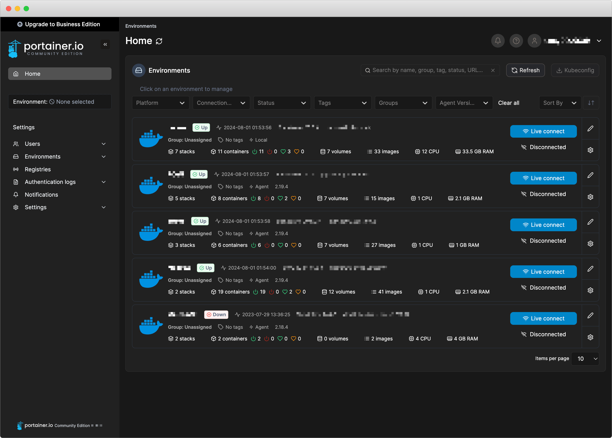
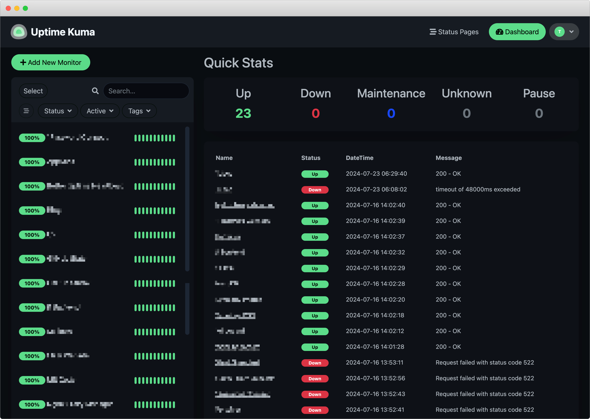

之前去 PyCon US 的其中一天有一個 Unconf[^1] 的主題就是 Self Hosting —— 集結世界各地~~沒有正常人生的宅男們~~分享他們都在他們家的車庫/地下室都養了些什麼牛鬼蛇神，我也藉此收穫了不少新玩具 (?)。

那就分享一下我自己也都架了些什麼酷酷的鬼東西吧 XDDDD

[^1]: [維基百科](https://zh.wikipedia.org/wiki/%E9%9D%9E%E4%BC%9A%E8%AE%AE)把他直翻為「非會議」但我覺得意思好像沒有很到位...總之就是在正式議程外由與會者自行發起的主題討論空間。

## 🏗️ 核心架構

容許老人我先來講古一下 XDDD

我的第一個全端 Side Project 雖然最終證明是一坨大便，但這個過程的確讓我用最硬核的方式，學會了很多奇怪的東西，最重要的，也是理解現在的很多工具在解決的是什麼問題。簡單來說，我當時開發和部署的流程大概是這樣：

- 把 code zip 起來
- `scp` 到 VM 上
- 解壓縮
- 安裝
- 設定開機 daemon
- 配置 DNS
- 部署 https 證書

然後如果最後跑不起來，再全部重來一次，然後思考要去看哪些 log 才能找到問題出在哪。

所以要搭起一套夠大系統，首先有幾個問題需要先解決：

- 怎麼「規模化」的部署
- 怎麼管理
  - 上/下線
  - 升/降級
  - 監控
  - 備份/復原

所以有了多年的經驗，我現在整理出來的流程大概是這樣：

- 用 [terraform](https://github.com/tomy0000000/terraform) 在雲端平台建立 VM 或其他 Infrastructure，像是 Lambda Function 或是 S3 bucket
- 用 [dotfiles](https://github.com/tomy0000000/dotfiles) 裡寫好的腳本來建立一個沒有 root 權限的使用者和配置 SSH 連線
- 在本機用 Ansible [playbooks](https://github.com/tomy0000000/playbooks) 來對 VM 執行一系列的 docker 指令操作
- 應用程式用 Docker Compose 來封裝

用白話文的說就是：自動化

最大程度的減少需要手動操作的部分，就可以減少出錯的機率。最理想的情況下就是，在系統出任何問題的時候，我可以隨時把預先準備好的腳本拿出來執行，然後我就可以即時產生一套新的系統上線使用，然後後續有空再慢慢研究原本的系統是出了什麼問題。

## ⚙️ 服務管理：Portainer

前面提到我的服務全部都是用 Docker Compose 來部署的，所以當時就想找一個有漂亮的介面的 App 來操作。其實 Docker 自己出的 Desktop 還蠻好用的，現在甚至還可以安裝外掛 (the what?)，最可惜的就是不支援操作遠端的 engine。

於是最終找到最接近的第三方 client 就是 [Portainer](https://github.com/portainer/portainer)。基本上跟 Docker Desktop 差不多，Community Edition 就可以 cover 我當時所有的需求。

但自從引入了 Ansible playbook 之後就很少在使用了，真的複雜到需要手動操作的，直接敲指令還是快一點。

應該過幾年寫第二代的時候就會拆掉了吧。

## 🧸 服務監控：Uptime Kuma

初期開始架一些服務之後，很快就面臨到一個問題：人在外面，用手機連上服務要用的時候才發現，乾，服務爆了。說實在自己搞系統本來就容易出錯，升級、上下線這種問題容易發現也就算了，最難搞的就是有些服務的流量或是系統資源運用不均衡，經常在不注意的時候把 RAM 吃光，然後同一台 VM 上的服務全部都會一起下線，比方說等等會提到的 Plausible Analytics。

於是就想說來找一個可以監控網頁狀態的系統。簡單來說就是他會每隔幾分鐘就去戳一下系統，看看他有沒有正常回傳 HTTP 200 OK，出現其他非預期的結果就代表系統下線，送一個通知到我的手機讓我知道。

一開始找到的是 [Better Stack](https://betterstack.com/)，免費方案可以有 10 組監控，但是我的服務太多了塞不下 XDDDD 於是後來就輾轉又找到 [Uptime Kuma](https://github.com/louislam/uptime-kuma)，一個香港人自己寫的小 side project[^2]。兩者的功能基本上差不多，所以幾乎是無痛轉移上去。

轉移完之後以為就沒事了嗎？當然沒這麼容易。

架設 Uptime Kuma 的同一台 VM 上當然還跑了其他的服務，於是某一次我想連某一個服務的時候，發現奇怪他怎麼掛了，而且我甚至沒收到通知，然後才發現 Uptime Kuma 自己在同一台 VM 上，他也掛了，全家都掛了：）

<iframe src="https://giphy.com/embed/3NVkBM9a5WuUJy1jB9" width="480" height="480" style="" frameBorder="0" class="giphy-embed" allowFullScreen></iframe>

後來的解決方案，就是把它們兩個整合起來，做雙重保障。一般情況下，他們的監控模式都是主動式的，也就是他們會主動去檢查監控的服務，但也可以設定成被動模式，在這個模式下，他會生成一個隱藏的 API 接口，然後被監控的服務要主動發請求到這個接口來回報自己還活著。所以我就在 Better Stack 上面開一個接口，然後在 Uptime Kuma 這邊註冊一個要監控的服務，接到 Better Stack 上。



graph LR

A[Better Stack]
B[Uptime Kuma]
C[My Other Service A]
D[My Other Service B]

A <--> B
B --> C
B --> D


<figcaption class="text-center">大概像這樣，所以之後要出現服務下線我卻沒收到通知的情況只有一種可能就是他們都掛了 應該是不太可能 吧 (?</figcaption>

[^2]: 這專案甚至有 5 萬多顆星星，太強了

---

不知不覺寫了好多，看樣子應該是會拆成三部曲。

下一集來介紹一些真的有實際用途的服務！
