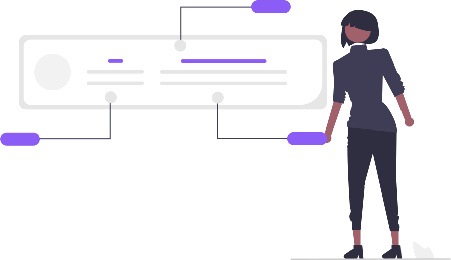

There was a moment when I almost opened an online privacy policy generator, but I stumbled a while and thought, why waste time making this crap. So I think it's best to write one in plain English instead.

I have no interest in any individual visiting and reading my blog, which is why I don't collect any "particular" info about anyone.

But I do interested in the whole picture of my audiences, which is why I track visitors with my self-hosted Plausible Analytics instance.

## TL;DR

Data I collected: 

 Which website leads my visitors here

 What countries do my visitors come from

 What device do my visitors use (Phone, Tablet, or Computer)

 What operating systems do my visitors use (Windows, Mac, iOS, Android)

 What browsers (and versions) do my visitors use (Chrome, Safari, Firefox...)

 Which pages have more/less visits

Data I did not collect: 

 Data regarding any individual visiting this site (name, phone, email, social accounts...)

## If you still have concerned and want to Opt-out

You can block my tracker with blockers (like uBlock, Adblock Plus, or AdGuard) following [guides from Plausible](https://plausible.io/docs/excluding)

- `yourdomain.com` should be `blog.tomy.me`
- `yourproxy.com` should be `a.tomy.me`

Or a more straightforward approach: don't visit ;-)
