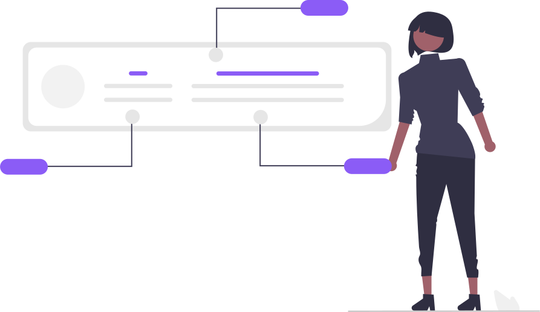

雖然一度有點想直接去網路上用隱私權政策產生器生一篇出來，但後來想想這樣真是浪費時間又沒有意義，所以我還是用白話文認真寫一下好了。

我對於誰來看這個網站實在是沒什麼興趣，所以這個網站並不會收集任何關於「個人」的資料。

但我確實對我的「整個」觀眾群有興趣，因此我使用了我自己架設的 [Plausible Analytics](https://plausible.io/) 來追蹤訪客的特徵資訊。

## TL;DR

我看得到的資料：

 訪客從哪些網站來

 訪客來自哪些國家

 訪客使用哪些裝置 (手機、平板、或是電腦)

 訪客使用哪些作業系統 (Windows, Mac, iOS, Android)

 訪客使用哪些瀏覽器 (Chrome, Safari, Firefox...)

 哪些頁面觀看次數較高/低

我看不到的資料：

 某一個訪客的任何資料 (姓名、電話、email、社群網站帳號...)

## 如果你還是不希望你的資料被收集

你可以根據 [Plausible 官方的指南](https://plausible.io/docs/excluding)使用阻擋器 (如：uBlock, Adblock Plus, 或是 AdGuard) 來遮蔽掉我的追蹤器

- `yourdomain.com` 的部分為 `blog.tomy.me`
- `yourproxy.com` 的部分為 `a.tomy.me`

或是更簡單的方法：不要來看 ;-)
